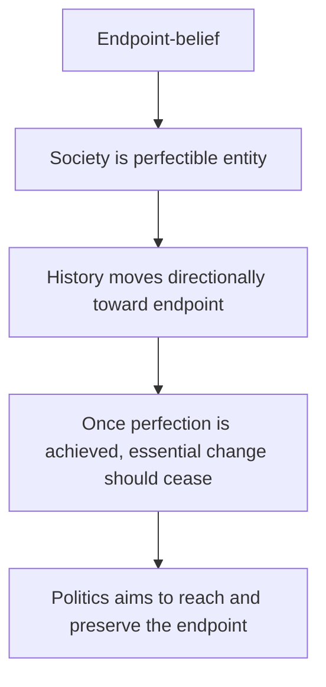
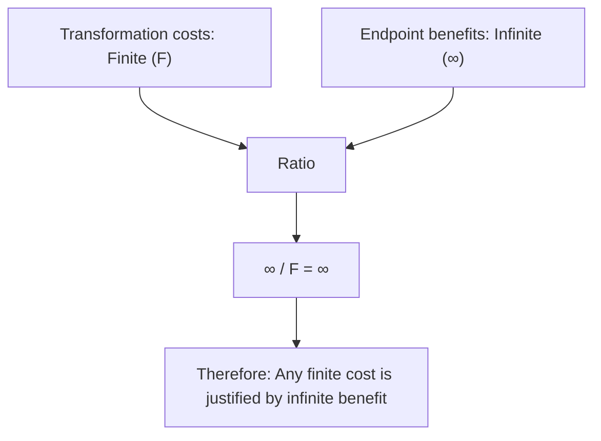

# PART II: COMPLETE POLITICAL LOGICS {-}

# The Blueprint Worldview

Chapter 2 established that believing in historical endpoints systematically associates with certain politics. But what exactly are those politics? How does the endpoint premise generate a complete worldview?

This chapter develops the full Blueprint logic—**for the first time**. From ontology to epistemology to ethics to politics. From philosophical premise to institutional structure. The complete derivation.

**Important**: Blueprint Type is an **ideal type**—a pure logical form constructed for analytical clarity. Most reality combines Blueprint and Principle elements. This chapter presents the logic in pure form to reveal its internal structure.

Extreme Blueprint (Jacobin France, Soviet Union, Nazi Germany, Khmer Rouge Cambodia) approximates this logic closely. Moderate Blueprint (Nordic social democracy, Fabian socialism) exhibits the logic but constrained by robust structures. Most political movements mix elements.

The exposition proceeds systematically through logical levels, showing how each follows from the previous.

## Core Definition

Blueprint Type is political logic derived from single metaphysical premise: history moves toward a knowable, achievable endpoint—a perfect or ideal state where essential change should cease.

This premise generates a complete political worldview. Not mechanically—human choices, structural constraints, cultural patterns all mediate. But systematically—the logic flows coherently from premise to politics.

The endpoint content varies radically across Blueprint ideologies. Communist endpoint envisions classless society, stateless abundance, end of alienation. Nazi endpoint pursued racially pure Aryan Volksgemeinschaft, thousand-year Reich. Jacobin endpoint sought rational republic based on Enlightenment reason, reign of virtue. Islamic fundamentalist endpoint imagines restored Caliphate under Sharia, perfect submission. Techno-utopian endpoint dreams of post-scarcity automated abundance, transcended human limits. Progressive endpoint aims for perfect social justice, eliminated structural oppression.

These contents are utterly incompatible. Communists and Nazis murdered each other. Jacobins and religious fundamentalists represent opposite worldviews. Progressives and reactionaries disagree about nearly everything.

Yet the logical structure is identical. All presume history has direction and destination. All believe the endpoint is knowable—we can specify its features. All believe the endpoint is achievable—we can reach it through political action. All believe essential change should cease once the endpoint is reached—the endpoint is stable perfection.

Structural implications flow systematically from this shared logic. If the endpoint is perfect and knowable, current reality deviates from it. The deviation must be corrected. Correction requires comprehensive transformation—economic structures, social relations, cultural patterns, institutional arrangements all must change. Piecemeal reform is inadequate; synchronized transformation is necessary. Intermediary institutions obstruct transformation; they must be eliminated or subordinated. Traditional morality constrains transformation; it must be superseded by revolutionary ethics serving the endpoint.

These implications derive logically from the endpoint premise, regardless of content. This explains convergence: why do communist and fascist regimes—opposite ideological contents—produce nearly identical political structures? Because both hold endpoint-belief, generating identical structural implications despite different endpoint contents.

This chapter develops ideal-typical Blueprint logic. Reality is usually mixed. But understanding pure logic reveals what Blueprint tendencies look like when unconstrained.

The derivation proceeds through five logical levels. Section 3.2 examines ontology: What kind of entity is society if it can reach perfection? What is time's nature if history has an endpoint? Section 3.3 analyzes epistemology: How can we know the endpoint? Who possesses this knowledge? Section 3.4 explores ethics: What moral principles govern pursuit of the endpoint? How are means justified by ends? Section 3.5 traces political implications: What institutions follow from endpoint-belief? Why does centralization emerge? Section 3.6 examines historical patterns: How has Blueprint logic manifested across different contexts?

---**Section 3.4** examines ethics: If the endpoint is supremely valuable, how does this shape moral reasoning? When do ends justify means?

**Section 3.5** examines politics: How do ontological, epistemological, and ethical premises translate into institutional structures and political practices?

**Section 3.6** examines historical patterns and theoretical limits: When does Blueprint logic manifest empirically? What constrains or enables it? What doesn't the framework explain?

The logic unfolds systematically. Each level follows from the previous. By the end, a complete worldview emerges—coherent, comprehensive, and profoundly consequential.

## Ontology: The Perfect State

Blueprint Type begins with an ontological claim about society's fundamental nature: **a perfect state exists toward which society can and should move**.

This isn't empirical prediction (perfection will happen) but metaphysical commitment (perfection is possible). The claim is ontological—about what kind of entity society is—not predictive.

Three interconnected ontological commitments structure Blueprint logic:

### Society as Perfectible Entity

Blueprint Type treats society as entity capable of completion. Not "society constantly improves" (compatible with no-endpoint) but "society can reach completion" (endpoint-specific). Fundamental problems can be solved, contradictions overcome, conflicts resolved—permanently.

Different Blueprint ideologies specify different perfections. Communist ideology envisions class conflict eliminated through collective ownership, alienation overcome through non-exploitative labor, scarcity transcended through rational planning and technological development. When class antagonisms disappear, the state apparatus withers away. Nazi ideology pursued racial purity achieved through elimination of corruption, organic national community unified under Führerprinzip, Lebensraum secured for Aryan flourishing. Degenerate modernity would be replaced by authentic Volksgemeinschaft. Jacobin revolutionaries sought reason's reign established through Enlightenment principles, superstition eliminated through education, virtue cultivated through civic religion, corrupt aristocracy replaced by rational republic.

The contents differ radically—these visions are utterly incompatible. But the ontological structure is identical: society is entity capable of reaching completed perfection.

This contrasts fundamentally with treating society as evolutionary process without completion. If society is process, no final state exists—problems shift, contradictions persist, conflicts continue taking different forms. But if society is perfectible entity, completion is possible.

This perfectibility assumption generates systematic implications. If society can be perfected, current imperfection is not permanent condition but temporary deviation. The gap between current reality and perfect state can be measured and closed. Politics has ultimate purpose: reaching perfection. Once perfection is achieved, essential politics ends (administration of things replaces governance of persons, in Marx's phrase). The endpoint isn't merely "better"—it's qualitatively different, resolving contradictions that generate all previous political conflict. It represents stable perfection, not temporary improvement.

### Historical Directionality

Blueprint Type posits that history moves directionally toward the endpoint. Not circular repetition (ancient cyclical time) or random drift (chance variation), but directed movement toward destination.

This directionality might be understood with varying degrees of determinism. Strong determinism holds that history must reach the endpoint—material contradictions or historical laws guarantee it. Political action can accelerate or delay but cannot prevent the inevitable progression. Vulgar Marxist historical materialism exemplifies this: economic base determines superstructure, class contradictions inevitably generate revolution, communism is scientifically certain.

Soft determinism sees history as tending toward the endpoint without absolute inevitability. Setbacks are possible but progress is the general direction. Political action matters significantly but works with historical currents. Progressive belief that "the arc of history bends toward justice" reflects this view—not inevitable but directional, with regression possible yet overall trajectory toward expanding rights, inclusion, equality.

Contingent teleology holds that history could reach the endpoint if political action succeeds, but offers no guarantee. The endpoint is achievable goal requiring deliberate political will. Revolutionary vanguardism embodies this: the masses won't spontaneously achieve consciousness; the Party must force historical progression; without correct political leadership, the endpoint won't be reached.

The strength of directionality varies across Blueprint ideologies. But all share the commitment that history has telos—purpose and proper direction. The endpoint isn't arbitrary human preference but history's own goal.

This teleological understanding generates profound political implications. If history has direction, then past is worse than present and present worse than future. Change either aligns with or opposes historical direction. Political positions occupy either "right side" or "wrong side" of history. Those who understand historical direction possess knowledge justifying authority over those who don't. Resistance to transformation isn't merely disagreement—it's opposition to history itself.

The endpoint functions as magnetic pole organizing political space. All positions are measured by whether they advance or retard progress toward it.

### Temporal Arrest as Achievable and Desirable

Blueprint Type maintains that time can and should be arrested at the endpoint. Not literally stopping time's physical passage, but stopping essential change—the kind of change that would alter fundamental social structures.

The endpoint is not phase in ongoing evolution but destination terminating essential development. Society will still need maintenance, administration, adjustment. But fundamental transformation becomes neither necessary nor desirable once the ideal state is achieved.

Marx articulated this clearly: in communist society, history as class struggle ends. Administration of things replaces government of persons. Revolutionary change becomes obsolete because the contradictions generating change have been overcome. Nazi ideology similarly conceived the Third Reich as thousand-year Reich—not temporary phase but permanent order. Once racial purity was achieved, it would remain stable. The organic community, once established, would endure. Fukuyama's progressive variant declared liberal democracy the "end of history"—not that nothing more happens, but that no better system exists. Ideological evolution completes.

The temporal logic creates profound tension. Before reaching the endpoint, time appears as ally—historical progress serves political goals, accelerating time's movement toward the ideal. But at the endpoint, time becomes potential enemy—further change would constitute deviation from achieved perfection. Therefore: achieve the endpoint, then preserve it against temporal change.

This generates systematic implications. Spatio-temporal synchronization becomes necessary—the same state must exist everywhere simultaneously. Local variation represents deviation requiring correction. Spontaneous evolution threatens preserved perfection. Institutions must enforce stability against time's destabilizing flow. Future generations must be protected from deviating from achieved perfection. The endpoint, once reached, must be defended against time itself.

### The Ontological Package

These three commitments form coherent package:

This ontological structure generates everything downstream. Epistemology, ethics, institutions all flow from these metaphysical premises.

Is this ontology true? Blueprint Type doesn't require proving it empirically. The endpoint is metaphysical commitment, not empirical prediction. It's framework for understanding reality, not hypothesis tested against data.

But the commitment has consequences. If you believe society is perfectible entity moving toward endpoint where change should cease, systematic political implications follow. The next sections trace those implications.

## Epistemology: The Fatal Conceit

If a perfect endpoint exists, we must be able to know it. Blueprint Type requires epistemic confidence: we can know what perfection requires.

This confidence takes different forms across Blueprint ideologies. But all share the conviction that the endpoint is knowable and that knowing it grounds political authority.

### Knowledge Sources

Different Blueprint ideologies claim different knowledge sources for the endpoint, but all share the conviction that the endpoint is knowable and that knowing it grounds political authority.

Reason provides the foundation for Jacobin and some progressive variants. Pure reason can discern universal principles; the endpoint is rationally derivable. Superstition, tradition, and revealed religion are obstacles corrupting reason with prejudice. The Enlightenment project held that reason can determine correct social organization. Philosopher-kings or enlightened legislators design rational institutions. The endpoint is what reason commands. Robespierre declared: "The French Republic is founded on reason and virtue." Not empirical discovery but rational deduction—aristocratic privilege is irrational, egalitarian republic is rational. Therefore: destroy aristocracy, establish republic.

Science grounds Soviet scientific socialism and technocratic modernization. Scientific laws govern social development just as they govern nature. The endpoint is scientifically predictable, politics becomes applied social science. Soviet confidence in "scientific socialism" held that history moves through scientifically determined stages, contradictions generate transitions according to dialectical laws, communism is scientific certainty rather than mere aspiration. The Party's authority derives from mastering historical science. Contemporary technocracy inherits this logic: experts discover optimal policies through data analysis, the best society is what evidence-based policy achieves, epistemic authority follows from scientific expertise.

Historical laws provide certainty for Hegelian-Marxist dialectic. History reveals its own telos; the endpoint is historically inevitable. Understanding history discloses where it's going. Hegel saw history as Spirit's self-realization, contradictions generating dialectical progression toward Absolute Knowledge, the endpoint being Reason actualized in state. Marx transformed this: history is material development driven by productive forces and class struggle, each mode of production generates its own negation, feudalism yields to capitalism yields to socialism yields to communism. The endpoint is historical necessity.

Divine revelation specifies the ideal for theocratic systems. God's will determines perfect order, the endpoint is revealed truth. Reason and science are insufficient or corrupting—only revelation provides certainty. Islamic fundamentalism holds that Sharia law specifies ideal society, the endpoint is restored Caliphate implementing divine commands, political authority derives from religious knowledge. Historical Christian theocracy similarly conceived the Kingdom of God on earth as biblically specified endpoint, with secular authority serving divine purposes.

The specific source varies—reason, science, historical laws, revelation. But all Blueprint variants claim: we can know the endpoint with sufficient certainty to organize politics around reaching it. This epistemic confidence is Blueprint Type's essential feature.

### The Fatal Conceit (Hayek's Critique)

Friedrich Hayek termed this epistemic confidence "the fatal conceit"—the belief that human reason can comprehend social complexity sufficient to design perfection.

The critique doesn't deny knowledge exists. It denies knowledge sufficient for comprehensive social engineering.

Why is this conceit "fatal"? Hayek identifies four dimensions of the knowledge problem that make comprehensive planning epistemically impossible.

First, knowledge is dispersed across millions of individuals, each possessing local, contextual, tacit knowledge of particular circumstances of time and place. No central authority can aggregate this knowledge. The information required to plan society rationally doesn't exist in aggregable form. The farmer knows local soil conditions specific to his fields this season. The entrepreneur knows local market opportunities emerging from particular customer networks. The worker knows specific production techniques adapted to particular machinery configurations. This knowledge cannot be transmitted to central planners without losing its contextual richness.

Second, much knowledge is tacit—embodied skill, practical wisdom, cultural understanding that cannot be articulated explicitly. Polanyi observed: "We know more than we can tell." This tacit dimension cannot be codified into planning models. A master craftsman cannot fully explain how he knows when wood is properly seasoned or metal correctly tempered. Traditional practices preserve tacit knowledge accumulated over generations. Destroying tradition to implement rational designs loses knowledge we didn't know we had.

Third, even if we could aggregate current knowledge, the future remains radically uncertain. Technology develops, preferences evolve, resources shift in unpredictable ways. Perfect planning would require knowing future states. But future is not merely unknown—it's unknowable. Central planning assumes either static conditions or predictable change. Reality is dynamic in ways that cannot be anticipated.

Fourth, social complexity exceeds any individual's or organization's comprehension capacity. Society is complex adaptive system where millions of actors making decentralized decisions generate emergent orders—markets, cultures, languages, norms—that no mind designed and no mind fully comprehends. Attempting to replace emergent order with designed order assumes the designer comprehends what emerged. But complexity emerges precisely because it transcends comprehension.

The political implication is stark. If knowledge sufficient for comprehensive design doesn't exist, Blueprint politics rests on epistemic impossibility. The endpoint might be rationally appealing, scientifically predicted, historically inevitable, or divinely revealed. But implementing it requires knowledge no person or organization possesses. This is why Hayek calls it "fatal"—not just error but impossibility, not knowing imperfectly but presuming to know what cannot be known.

### Blueprint Response: Vanguard Epistemology

Blueprint Type doesn't deny these epistemic challenges. It responds that the vanguard possesses knowledge the masses lack.

Leninist party vanguard exemplifies this stance. The masses suffer false consciousness—ideological confusion preventing them from recognizing their true interests. The Party, guided by scientific socialism, understands historical laws. Party authority derives from superior knowledge. Lenin argued that the working class alone cannot develop revolutionary consciousness. At most, they achieve trade unionism—economistic demands within capitalism. Revolutionary consciousness requires Party education providing scientific understanding.

Therefore: Democratic equality is insufficient. Those with knowledge must guide those without.

Technocratic vanguard claims that

Complex policy requires expertise. The masses lack technical knowledge to evaluate options. Experts—economists, scientists, policy analysts—possess knowledge justifying authority.

Therefore: Technical questions should be decided by experts, not democratic majorities. Evidence-based policy replaces ideological politics.

Ideological vanguard holds that

The enlightened understand moral truth the masses don't yet grasp. Progressive activists see structural oppression invisible to those benefiting from it. Anti-racist educators recognize racism those within it cannot.

Therefore: Those with correct consciousness must lead. Resistance reflects ignorance or complicity requiring correction through education or pressure.

The epistemic structure is:

In each case: Knowledge sufficient for transformation exists. But it's not universally distributed. It concentrates in vanguard—party, experts, enlightened activists. This knowledge asymmetry justifies vanguard authority.

The masses will eventually understand—after transformation succeeds, after education works, after consciousness evolves. But during transformation, vanguard knowledge justifies vanguard power.

### Why Vanguard Epistemology Compounds the Problem

Hayek's critique applies even more forcefully to vanguard epistemology:

If knowledge is dispersed across millions, concentrating authority in vanguard means suppressing most knowledge. The very concentration that Blueprint logic requires destroys the distributed knowledge that makes society function.

The vanguard might possess theoretical sophistication. But they lack local knowledge of particular circumstances. Soviet planners knew economic theory but not which farms could grow which crops in which conditions. The "fatal conceit" isn't theoretical ignorance—it's presuming theoretical knowledge can replace practical dispersed knowledge.

Moreover, vanguard concentration creates perverse incentives. If authority derives from claiming superior knowledge, admitting ignorance threatens power. The system rewards confident assertion over epistemic humility. This generates systematic overconfidence precisely where uncertainty is greatest.

The vanguard might genuinely believe they possess knowledge. But belief doesn't create knowledge. And institutional structures reward claiming knowledge whether it exists or not.

A tragic cycle emerges. The vanguard claims knowledge justifying comprehensive transformation. Transformation disrupts organic coordination relying on dispersed knowledge. Disruption causes crises—economic collapse, social breakdown, resistance. But crises seem to prove insufficient transformation rather than failed epistemology, leading to more radical transformation. The cycle repeats until catastrophe or structural constraints force moderation.

The epistemic failure compounds. Each crisis generated by knowledge insufficiency is interpreted as requiring more comprehensive control, which requires claiming even more knowledge, which generates larger crises.

### From Epistemology to Ethics

Blueprint epistemology creates foundation for Blueprint ethics. If we know the endpoint, and the endpoint is perfect, powerful ethical implications follow.

The next section examines how epistemic confidence about perfection generates teleological ethics where ends justify means.

## Ethics: Ends Justify Means

Blueprint ontology establishes that a perfect endpoint exists. Blueprint epistemology claims we can know it. Blueprint ethics follows: reaching the endpoint justifies extraordinary means.

This isn't crude "anything goes." Sophisticated Blueprint thinking maintains constraints. But when conflict arises between traditional morality and endpoint achievement, the endpoint takes precedence.

### The Mathematical Logic

From Blueprint perspective, the endpoint represents infinite good while means represent finite costs. The mathematical logic follows: infinite exceeds finite, therefore no means is prohibited in principle.

The endpoint solves fundamental human problems permanently. Communist endpoint eliminates exploitation, Nazi endpoint removes racial corruption, Jacobin endpoint overthrows irrational authority, progressive endpoint eradicates social injustice, theocratic endpoint resolves spiritual alienation. Once achieved, the endpoint provides permanent freedom from oppression, stable harmonious society, authentic human flourishing, endless generations living perfected life. Compare finite suffering during transformation to infinite benefit after—any finite cost becomes infinitesimal relative to infinite benefit.

The costs of transformation are finite. People killed during revolution number in thousands, millions, tens of millions—horrifying numbers, but finite. Property destroyed, institutions disrupted, traditions abandoned—devastating losses, but bounded in scope and duration. Suffering during transition lasts years, decades, perhaps a generation—terrible span for those who live it, but finite relative to infinite future.

Transformation requires disrupting current lives, overcoming resistance, violating traditional rights, using coercion, and accepting casualties. These costs are real. Blueprint thinking isn't callous about suffering. But costs are finite—limited to transformation period, affecting limited populations, temporary relative to eternal benefit.

The calculus proceeds as follows:

This isn't cartoonish villainy. It's logical derivation from premises. If the endpoint truly is infinite good, and transformation truly can reach it, then finite costs during transformation are rationally acceptable.

### Teleological Ethics vs. Deontological Constraints

Traditional morality often imposes deontological constraints—some actions are wrong regardless of consequences. Blueprint ethics challenges this fundamental stance.

Consider the prohibition against intentionally killing innocents even to prevent greater harm. Blueprint response treats this as valuing moral rules above human welfare. If killing one innocent prevents genocide of millions, is the rule really more important than millions of lives? Rigid deontology sacrifices real people to abstract principles.

Or consider the prohibition against violating individual rights even for collective benefit. Blueprint response holds that rights are socially constructed. If "rights" protect oppression, they're not genuinely rights but ideology serving power. True freedom comes from transforming structures that generate false consciousness about rights.

Or the prohibition against treating persons as mere means to ends. Blueprint response observes that under current structures, persons are already treated as means—workers exploited by capital, citizens manipulated by propaganda, minorities oppressed by hierarchy. Transformation liberates people from being treated as means. Temporary coercion during transformation serves eventual authentic autonomy.

The pattern emerges: traditional morality is either abstract principle ignoring real consequences, or ideology preserving unjust status quo. Blueprint ethics is consequentialist—actions are justified by whether they advance or retard progress toward the endpoint.

### Historical Necessity as Moral Justification

Many Blueprint ideologies add another layer: the endpoint isn't merely desirable—it's historically necessary. This compounds teleological ethics with historical determinism.

If transformation is historically necessary, resistance isn't merely wrong—it's futile. Fighting historical necessity is like fighting gravity. The endpoint will be reached; the question is how much suffering occurs during the transition. Therefore, accelerating historical necessity minimizes overall suffering. Quick decisive transformation prevents prolonged agony of gradual collapse.

Robespierre declared terror to be "prompt, severe, inflexible justice" serving virtue. The Republic's enemies must be eliminated not from cruelty but from historical necessity. Hesitation would prolong suffering.

Lenin argued that revolutionary violence is historically progressive, accelerating transition that capitalism's contradictions make inevitable anyway. The bourgeoisie will resist, generating civil war. Revolutionary violence ends conflict more quickly than allowing prolonged class struggle.

Pol Pot insisted total transformation was required immediately. Year Zero erases corrupted past. Resistance reflects feudal mentality that history has already superseded. Eliminating resisters isn't murder—it's executing history's judgment.

Historical necessity combines with infinite good to create double justification. Not just "Endpoint is valuable enough to justify means" but "Endpoint is historically inevitable, therefore hastening it minimizes suffering." The transformation will happen. The only question is whether we accelerate it, minimizing transition costs, or delay it, prolonging suffering of living under contradictions. This adds urgency to teleological ethics—not merely that ends justify means, but that historical necessity makes transformation both inevitable and urgent.

### Revolutionary Morality vs. Bourgeois Morality

Blueprint thinking often distinguishes between "revolutionary morality" and "bourgeois/traditional/reactionary morality."

Bourgeois morality protects private property, serving capitalist exploitation. It respects individual rights, enabling oppression to continue. It prohibits violence, thereby disarming the oppressed. It maintains civility, enforcing false consciousness. These aren't neutral moral principles but ideology serving power.

Revolutionary morality serves collective liberation rather than individual selfishness. It prioritizes historical progress over static principles. It accepts necessary violence rather than pacifist complicity. It rejects bourgeois civility rather than false consciousness. This is presented as authentic morality serving human flourishing.

Trotsky declared: "The end justifies the means if the end is increase of human power over nature and the abolition of the power of humans over humans." Revolutionary ethics serves liberation while bourgeois ethics serves oppression.

This isn't nihilism. Blueprint thinking believes deeply in morality. But morality's content is determined by whether it serves or opposes the endpoint. Traditional constraints appear moral only because traditional ideology is hegemonic. Revolutionary morality reveals true ethics: whatever advances human liberation is good, whatever retards it is evil.

### The Practical Escalation

Teleological ethics tends to escalate in practice through a predictable sequence.

Stage 1 begins with necessary coercion. Some resistance requires force. Private property must be expropriated. Reactionaries must be suppressed. This is regrettable but necessary.

Stage 2 sees expanding necessity. Resistance exceeds expectations. Counterrevolutionaries are numerous. Saboteurs persist. The definition of "enemy" expands to include those insufficiently enthusiastic.

Stage 3 introduces preemptive elimination. Why wait for resistance to manifest? If certain groups will inevitably resist—bourgeoisie, kulaks, intellectuals, ethnic minorities—eliminate them preemptively. This prevents greater suffering later.

Stage 4 demands permanent vigilance. Even after apparent success, eternal vigilance is required. Hidden enemies might corrupt the revolution. Continuous purges are necessary to preserve purity.

Stage 5 generates purity spirals. Each purge reveals more enemies. Eliminating resisters requires eliminating those insufficiently zealous in elimination. Revolutionary morality demands ever-greater purity. Moderation becomes suspect.

The results are stark. Soviet Great Purges executed an estimated 600,000-1.2 million, imprisoning millions more. Targeting expanded from political opponents to "wreckers" to "social dangers" to arbitrary quotas. Nazi genocide initially targeted political enemies, escalated to racial elimination, eventually to industrialized genocide of 6 million Jews plus millions of others. Khmer Rouge killed approximately 1.7 million people—21-24% of Cambodia's population—targeting "enemies," then expanding to anyone with education, glasses, soft hands, foreign ties, or arbitrary suspicion.

The endpoint logic created ethical framework permitting escalation. Each stage seemed justified by previous: if some coercion is necessary, why not more? If some enemies must be eliminated, why not all potential enemies? If transformation is infinitely valuable, why accept any risk of corruption?

### Why Some Blueprint Thinking Moderates

Not all Blueprint thinking escalates to genocide. Nordic social democracy, Fabian socialism, progressive reformism maintain moral constraints despite endpoint-belief.

Why?

Gradual versus immediate endpoints differ fundamentally.

If endpoint is distant (achievable over decades), urgency is lower. Moderate means suffice for gradual progress. Immediate endpoint creates overwhelming pressure for extreme means.

Structural constraints matter.

Robust intermediary institutions, democratic procedures, cultural norms can constrain even radical ideologies. Nordic's strong cooperatives, independent unions, parliamentary traditions prevented escalation despite endpoint ideology.

Epistemic modesty plays a role.

Some Blueprint thinkers admit uncertainty about the endpoint's exact features. If we're unsure about perfection's specifications, revolutionary transformation becomes riskier. Incrementalism preserves option value.

Some progressives combine consequentialist goals with deontological constraints. They seek egalitarian endpoint while maintaining rights protections. This is theoretically inconsistent but practically moderating.

Societies with traditions of rational deliberation, consensus-seeking, and tolerance for complexity resist revolutionary romanticism. The same ideology manifests differently in different cultural contexts.

The pattern is clear: pure Blueprint logic tends toward teleological ethics justifying extraordinary means. But logic operates within structural and cultural constraints. When constrained, the escalatory tendency moderates. When unconstrained, escalation follows. The framework shows what pure logic tends toward. Structural theories explain what constrains or enables it.

## From Philosophy to Politics

Ontology, epistemology, and ethics generate political structures. This section traces how Blueprint philosophy translates into Blueprint politics.

### Centralization of Power

The logical derivation proceeds straightforwardly. If current reality deviates from the endpoint (ontology), we know what the endpoint requires (epistemology), and reaching the endpoint justifies necessary means (ethics), then politics must comprehensively reorganize society. Comprehensive reorganization requires coordinated direction. Coordinated direction requires centralized authority. Therefore: centralize power.

Dispersed power is incompatible with Blueprint logic because distributed authority allows local variation. Local variation generates deviation from uniform endpoint. Different regions might transform differently, creating inconsistency. Different institutions might resist aspects of transformation, creating incompleteness. The endpoint requires society-wide coordination. Markets generate spontaneous outcomes not controlled by any authority—incompatible with comprehensive planning. Federalism allows local authorities to resist central direction—incompatible with synchronized transformation. Independent intermediaries divide loyalties—incompatible with total mobilization. Therefore: eliminate competing power centers, concentrate authority, enable comprehensive direction.

Historical patterns confirm this tendency. Jacobin France destroyed federalism, eliminated guilds, subordinated Church, and centralized under Committee of Public Safety. Soviet Union abolished market economy, eliminated independent unions, destroyed local governance, and centralized under Party apparatus. Nazi Germany's Gleichschaltung (coordination) eliminated federalism, subordinated all associations, and concentrated power under Führer. Khmer Rouge evacuated cities, destroyed all traditional structures, and concentrated absolute power in Angkar.

Different ideologies, identical structural logic: if comprehensive transformation is the goal, centralized power is the means.

### Comprehensive Planning

Markets allocate resources through decentralized decisions responding to price signals. But prices reflect current conditions, not endpoint requirements. Market outcomes diverge from planned perfection. If the endpoint is knowable and transformation is necessary, market spontaneity must be replaced by comprehensive planning directing resources toward endpoint goals.

Markets are incompatible with Blueprint logic because they generate outcomes nobody plans. Entrepreneurs pursue profit, workers seek wages, consumers satisfy preferences—all guided by prices signaling relative scarcity. The emergent order serves no unified purpose. But Blueprint logic requires unified purpose: reaching the endpoint. Market spontaneity pursuing diverse purposes creates deviation from this unified goal. Therefore: abolish or severely constrain markets, replace with centralized planning directing all economic activity toward transformation.

The planning dream takes different forms. Soviet Gosplan determines all production quotas, coordinates all inputs and outputs, allocates all labor—scientific socialism replaces market chaos with rational coordination. Nazi Four-Year Plans mobilize economy for autarky and rearmament, where coordination supersedes market individualism. Maoist Great Leap Forward reorganizes entire economy according to rational collective principles.

The planning reality diverges catastrophically. Soviet chronic shortages, misallocations, and technological stagnation emerge because without price signals, planners cannot coordinate complex production chains. The knowledge problem Hayek identified manifests catastrophically. Nazi war economy only functions by preserving private ownership—contradicting total planning ideal—while directing production through command. Great Leap Forward causes famine killing tens of millions as central directives ignore local knowledge, generating systematic failures.

Planning's theoretical appeal remains despite empirical failures. If the endpoint is knowable, planning should work. Failures are attributed to insufficient control, sabotage, incomplete transformation—never to epistemic impossibility. Therefore, each planning failure generates calls for more comprehensive planning, more centralized control, more elimination of market remnants. The logic is self-reinforcing. Failures confirming knowledge limitations are interpreted as confirming insufficient commitment to the plan.

### Destruction of Intermediaries

Family, church, local community, voluntary associations, guilds, unions, ethnic groups, regional identities—all create loyalties competing with state. If total transformation is required, divided loyalties obstruct. Intermediaries preserve traditional patterns, resist synchronized change, and provide alternative sources of authority and meaning. Therefore: destroy or subordinate intermediaries, atomize society into individuals and state, eliminate competing loyalties.

Intermediaries obstruct transformation in systematic ways. Family transmits traditional values, protects private sphere, and resists state intrusion into personal life. Church provides moral authority independent of state, preserves "superstitious" worldviews, and claims transcendent purposes competing with political endpoint. Local community maintains traditional practices, enables mutual aid reducing state dependence, and preserves local knowledge resisting central uniformity.

Voluntary associations: Create horizontal connections bypassing state, enable collective action independent of state direction, preserve pluralism.

Ethnic/regional identities: Generate loyalties to group rather than to revolutionary cause, preserve "backward" cultures, resist assimilation into unified endpoint.

Each intermediary dilutes state power, preserves traditional patterns, enables resistance to transformation.

Historical patterns of intermediary destruction reveal systematic convergence. Jacobin France attacked the Church through dechristianization and Civil Constitution of Clergy, destroyed guilds and corporations, eliminated provincial distinctions, and created atomized citizenship. Soviet Union destroyed the Church through militant atheism and persecution, abolished private property eliminating family inheritance, collectivized agriculture destroying peasant communities, eliminated independent unions creating state-controlled labor front, and suppressed ethnic cultures through Russification. Nazi Germany subordinated churches through the Reich Church, implemented Gleichschaltung of all associations transforming boy scouts into Hitler Youth and unions into Labor Front, destroyed local autonomy through the Reichsstatthalter system, and eliminated the Jewish community through genocide. Khmer Rouge destroyed all religious institutions, abolished money, markets, and private property, evacuated cities destroying urban community, separated families with children raised collectively, and eliminated all traditional social structures.

Blueprint logic systematically generates intermediary destruction. The specific targets vary by ideology—church, market, family, ethnicity—but structural tendency is identical.

Why destruction is logical becomes clear when recognizing that intermediaries aren't merely obstacles to state power (authoritarian concern) but obstacles to total transformation (Blueprint concern).

Intermediaries aren't merely obstacles to state power (authoritarian concern). They're obstacles to total transformation (Blueprint concern).

Authoritarians want obedience. Blueprint thinkers want transformation. Obedience can coexist with private life. Transformation requires eliminating private spheres where traditional patterns persist. Therefore, Blueprint logic is more totalitarian than mere authoritarianism—it cannot tolerate areas of life not serving the endpoint.

### Spatio-Temporal Synchronization

The endpoint is perfect state requiring uniformity—same organization, same values, same consciousness everywhere simultaneously. Local variation creates deviation. Some regions transform while others lag, creating inconsistency. Gradual transformation allows unconverted sectors to contaminate converted sectors. Therefore: enforce synchronized transformation across all of society simultaneously.

Spatial synchronization demands same policies in all regions, central directives overriding local conditions, uniform implementation regardless of context. Soviet collectivization was imposed identically across Ukraine, Kazakhstan, and Russia despite different agricultural conditions—uniformity required despite local unsuitability. Nazi Gleichschaltung meant identical coordination nationwide, where federal states lost autonomy and regional variation was prohibited. Khmer Rouge evacuated all cities, organizing entire population into communes with identical structure, enforcing geographic uniformity absolutely.

Temporal synchronization requires rapid transformation without gradual evolution—revolutionary rupture creates Year Zero. Jacobins' revolutionary calendar restarted at Year One, erasing past and transforming present immediately. Soviets forced industrialization and collectivization within years rather than decades through Five-Year Plans compressing transformation. Khmer Rouge literally declared Year Zero, making all previous history irrelevant and requiring total immediate transformation.

Synchronization is considered necessary because gradual transformation leaves unconverted elements persisting. Workers might develop socialist consciousness while peasants retain traditional mentality. Urban areas might modernize while rural areas lag. This creates contradiction within society moving toward endpoint. Moreover, gradual transformation allows resistance to consolidate—each incremental step can be opposed. Revolutionary rupture overwhelms resistance through total immediate change. Therefore: comprehensive synchronized transformation—everything, everywhere, all at once.

Yet synchronization faces practical impossibility. Societies are complex, contexts differ, knowledge is local. Uniform policies ignoring local conditions generate failures. Synchronized transformation ignoring contextual variation creates catastrophes. But Blueprint logic cannot accommodate local variation without abandoning endpoint uniformity. Therefore, synchronization persists despite failures, generating escalating crises.

### New Man and Cultural Transformation

The endpoint requires not just institutional change but human transformation. Current human psychology reflects current corrupted structures. New structures require new consciousness. Therefore: create New Man through education, propaganda, reeducation, struggle sessions, and cultural revolution.

Different ideologies specify different New Man variants. Soviet New Man must overcome bourgeois selfishness, develop collective consciousness, embrace socialist labor, and dedicate self to building communism. Nazi New Man must purify Aryan racial instincts, eliminate degenerate modernity, embrace sacrifice for Volk, and embody warrior virtues. Maoist New Man must eliminate feudal mentality, develop revolutionary consciousness, serve people, and struggle against reactionary thoughts. Progressive New Man must overcome privilege, develop anti-racist consciousness, recognize structural oppression, and embrace intersectional identity.

Why cultural transformation is necessary

Changing institutions alone is insufficient. If consciousness remains bourgeois/corrupt/backwards, people will resist or pervert new structures.

Soviet experience: After revolution, "bourgeois specialists" couldn't be fully trusted. Their technical expertise was needed, but ideological reliability was suspect. Creating new socialist-educated generation was necessary.

Nazi experience: Weimar Germans were too cosmopolitan, too individualistic, too rational. Creating authentic German required cultural transformation through education, media, ritual.

Maoist experience: Traditional Chinese culture was feudal obstacle. Cultural Revolution must destroy "Four Olds" (old customs, old culture, old habits, old ideas).

Cultural transformation techniques emerge systematically. Education restructures schooling to create proper consciousness through Soviet polytechnical education, Nazi racial biology curriculum, and Maoist revolutionary education. Propaganda saturates public space with endpoint-affirming messages via Soviet socialist realism, Nazi Leni Riefenstahl films, and Maoist little red book. Reeducation forces those with incorrect consciousness to study until consciousness corrects through Soviet labor camps for "social dangers," Maoist struggle sessions, and Nazi concentration camps for "antisocials." Generational replacement writes off current generation as too corrupted, indoctrinating youth instead through Hitler Youth, Young Pioneers, and Red Guards.

Escalating totality becomes inevitable because cultural transformation cannot stop. Each layer of consciousness conceals deeper corruptions. Surface compliance masks internal resistance. Therefore ever-deeper penetration into private consciousness occurs. Soviet demanded not just public conformity but internal belief—thought crime became real crime, ideological deviation became betrayal. Nazi insisted racial consciousness must be total, with Germanic virtues permeating all thought, where degenerate art revealed thought corruption requiring elimination. Maoist insisted continuous revolution was required since each level of consciousness reform revealed deeper problems, making Cultural Revolution never complete because consciousness was never pure enough.

Why it cannot succeed

Human consciousness isn't blank slate. People aren't purely socially constructed. Attempts to force consciousness transformation generate resistance, resentment, strategic compliance masking genuine disagreement.

But Blueprint logic cannot acknowledge limits to malleability without abandoning possibility of creating consciousness matching the endpoint.

Therefore: escalating campaigns to transform consciousness, generating terror as resistance is interpreted as requiring more forceful transformation.

### The Systemic Pattern

These five political implications—centralization, planning, intermediary destruction, synchronization, cultural transformation—aren't coincidental associations. They derive logically from Blueprint ontology, epistemology, and ethics.

The logical derivation proceeds straightforwardly. If society can reach knowable perfection (ontology), we can know what perfection requires (epistemology), and reaching perfection justifies necessary means (ethics), then politics must centralize power because comprehensive direction is required, plan comprehensively because markets generate deviation, destroy intermediaries because competing loyalties obstruct, synchronize transformation because uniformity is required, and transform culture because new structures need new consciousness.

This explains Blueprint Type's defining feature: structural convergence despite content differences. Communist endpoint envisions classless abundance. Nazi endpoint pursues racial purity. Jacobin endpoint seeks rational republic. Utterly different contents produce identical structural implications because the temporal logic is identical. All believe history has endpoint. All attempt temporal arrest at perfection. All face same structural necessities: centralization, planning, synchronized transformation, intermediary destruction, and cultural control. The endpoint content varies while the structural implications converge.

## Historical Patterns and Their Limits

The previous sections developed Blueprint logic theoretically. This section examines historical patterns and acknowledges theoretical limits.

Three questions structure this section. Does history validate Blueprint logic? Section 3.6.1 shows extreme Blueprint cases converge as predicted. What about counterexamples? Section 3.6.2 addresses Nordic challenge directly. What doesn't the framework explain? Sections 3.6.3-3.6.4 acknowledge scope and limitations.

### The Pattern Across Extreme Cases

When Blueprint logic operates unconstrained by robust structures, a striking pattern emerges:

**Jacobin France (1793-1794)**:

Endpoint: Rational republic based on Enlightenment principles, reign of virtue

Centralization: Committee of Public Safety concentrated power

Planning: Maximum prices, controlled economy, rationing

Intermediary destruction: Dechristianization, guild elimination, federalism destroyed

Synchronization: Revolutionary calendar, uniform départements, simultaneous transformation

Cultural transformation: Cult of Reason, Festivals of the Supreme Being, revolutionary education

Outcome: Reign of Terror (16,000-40,000 executed), economic collapse, restored authoritarianism

**Soviet Union (1917-1953)**:

Endpoint: Classless society, stateless abundance, overcoming alienation

Centralization: All power to Party, eliminated political pluralism

Planning: Gosplan comprehensive central planning, Five-Year Plans

Intermediary destruction: Collectivization destroyed peasant communities, Church persecution, eliminated independent unions

Synchronization: Forced industrialization, simultaneous collectivization nationwide

Cultural transformation: New Soviet Man, socialist realism, atheist propaganda, purges of intellectuals

Outcome: Stalin's purges (estimated 600,000-1.2 million executed), Holodomor famine (3.5-5 million dead), Gulag system (millions imprisoned), economic stagnation

**Nazi Germany (1933-1945)**:

Endpoint: Racially pure Aryan Volksgemeinschaft, thousand-year Reich

Centralization: Führerprinzip, eliminated federalism, single-party state

Planning: Four-Year Plans, autarkic coordination

Intermediary destruction: Gleichschaltung of all associations, Church subordination

Synchronization: Nationwide coordination, simultaneous Aryanization

Cultural transformation: Racial biology education, Hitler Youth indoctrination, degenerate art elimination

Outcome: Holocaust (6 million Jews plus millions others murdered), totalitarian terror, aggressive war, total destruction

**Maoist China (1949-1976, especially 1966-1976)**:

Endpoint: Perfect communist society, elimination of class distinctions, revolutionary consciousness

Centralization: Party absolute control, Mao cult of personality

Planning: Great Leap Forward central directives, commune system

Intermediary destruction: Destroyed traditional family structures, eliminated private property, persecuted religious institutions

Synchronization: Simultaneous nationwide policies despite regional unsuitability

Cultural transformation: Cultural Revolution, struggle sessions, Four Olds destruction, Red Guard mobilization

Outcome: Great Leap famine (15-45 million dead), Cultural Revolution chaos (1-2 million dead), economic devastation, social trauma

**Khmer Rouge Cambodia (1975-1979)**:

Endpoint: Agrarian communist paradise, pure revolutionary society

Centralization: Angkar absolute power

Planning: Total economic reorganization, agricultural communes

Intermediary destruction: Evacuated all cities, destroyed all traditional structures, family separation

Synchronization: Year Zero, immediate total transformation

Cultural transformation: Executed educated persons, eliminated all "contaminated" consciousness

Outcome: Genocide of 1.7 million (21-24% of population), total social destruction, collapsed state

The convergence pattern reveals striking similarities. Five cases span different continents (Europe, Asia, America), different time periods (1789-1979), different endpoint contents (reason, class, race, nation, agrarian purity), and different cultural contexts (French, Russian, German, Chinese, Cambodian). Yet identical structures emerge: all centralized power absolutely, all attempted comprehensive planning, all destroyed intermediary institutions, all enforced spatio-temporal synchronization, all pursued cultural transformation creating New Man, and all generated humanitarian catastrophes.

This pattern suggests systematic relationship—not coincidence, not cultural artifact, not contingent evil leaders. Blueprint logic, when applied consistently and unconstrained by robust structures, systematically generates these outcomes. The endpoint contents are incompatible (Nazis murdered communists; Soviets opposed Jacobins). But the structural logic is identical because the temporal premise is identical: history has endpoint requiring comprehensive synchronized transformation forcing temporal arrest.

Limitations of this evidence must be acknowledged. This doesn't "prove" causation since correlation isn't causation. Other factors matter including leaders, contexts, and contingencies. Historical analysis is interpretive rather than experimental. But the convergence is striking. When philosophers derive similar implications theoretically and historians observe similar patterns empirically, this suggests the theoretical framework captures real causal mechanisms. The pattern is consistent with Blueprint logic. This doesn't exclude other explanations but validates the framework's analytical power.

### The Nordic Challenge

Nordic social democracies present crucial challenge to this framework.

#### 3.6.2.1 Stating the Problem

Nordic countries (Sweden, Norway, Denmark, Finland) exhibit Blueprint characteristics. Social democratic ideology envisions explicit endpoints through comprehensive welfare state, near-zero inequality, and universal public services—the Swedish "Folkhemmet" (people's home) concept represents idealized egalitarian society. Systematic planning manifests through extensive state intervention, coordinated industrial policy, universal public services, high taxation, and redistributive policies. Egalitarian ideology dominated politics for decades through social democratic consensus insisting class distinctions should be eliminated and solidarity is supreme value. Blueprint rhetoric appeared explicitly as politicians used transformational language—Olof Palme spoke of "democratic socialism" as endpoint.

Yet Nordic didn't become totalitarian. No terror occurred—no mass purges, no political executions, no concentration camps, no genocide. Intermediaries survived—cooperatives remained strong, unions retained independence, churches maintained social role, municipalities kept autonomy. Democratic institutions persisted through free elections, peaceful transfers of power, political pluralism, and protected civil liberties. The model remained stable for decades as social democracy persisted from 1930s-1990s without collapsing into authoritarianism or generating humanitarian catastrophe. Economic success emerged through high living standards, low poverty, low corruption, and technological sophistication.

The challenge emerges: How does the framework account for this? Is Nordic a counterexample refuting the theory?

#### 3.6.2.2 Partial Answer: Degrees Matter

The framework distinguishes immediate from gradual endpoints.

Immediate endpoint logic demands perfection must be reached now. Current reality is intolerable. Every day of deviation is injustice requiring immediate correction. Comprehensive transformation is required immediately. All means are justified by urgency. Examples include Jacobin Terror, Soviet rapid collectivization, Nazi total coordination, and Khmer Rouge Year Zero.

Gradual endpoint logic treats perfection as distant goal. Current reality is imperfect but tolerable. Reform proceeds step-by-step over decades, working within existing constraints where moderate means suffice. Examples include Nordic social democracy building welfare state over 50+ years, Fabian "inevitability of gradualness," and progressive incrementalism.

Urgency correlates with radicalism. Immediate endpoint creates overwhelming pressure for extreme means leading to totalitarianism. Gradual endpoint makes moderate means acceptable, leading to democratic socialism.

This explains degrees: Nordic represents moderate Blueprint rather than extreme Blueprint. Both hold endpoint-belief, but urgency differs fundamentally. Soviet couldn't tolerate capitalism persisting for decades, requiring immediate transformation. Nordic could build welfare state gradually across generations, making immediate transformation unnecessary.

But this answer is incomplete. It describes the difference between immediate and gradual without explaining why Nordic chose gradual while Soviet chose immediate.

Why did Nordic social democrats accept gradualism? Not merely ideology but structural reality.

#### 3.6.2.3 Deeper Reality: Social Structures Constrain

Why did Nordic social democrats choose gradual approach? Social structure constrained them.

Nordic societies in the late 19th and early 20th centuries had developed robust intermediary structures that actively constrained radical politics. Cooperative movements became deeply embedded in daily economic life. Sweden's Kooperativa Förbundet, founded in 1899, established consumer cooperatives alongside producer cooperatives in dairy and forestry sectors, while credit cooperatives provided financial services. These organizations provided real economic power independent of state control, creating institutional foundations that couldn't be easily dismantled.

Strong trade unions developed with significant independent power. The LO (Swedish Trade Union Confederation) organized pragmatically rather than revolutionarily, maintaining sectoral bargaining with real negotiating power while remaining independent of state control. The Ghent system, where unions administered unemployment insurance, created substantial institutional power that made unions indispensable partners rather than subordinate organizations.

Robust local self-government traditions took root. Swedish and Norwegian kommuner exercised significant autonomy with local tax authority and service provision responsibilities at municipal level. Strong traditions of local participation combined with constitutional protections for local governance created distributed power structures resistant to centralization.

Dense civil associations created horizontal social networks throughout society. Study circles (studiecirklar) promoted adult education, while temperance societies, folk high schools, athletic associations, and church-affiliated organizations built community bonds that crosscut class divisions. These associations formed thick social fabric that couldn't be easily torn apart by state action.

The Lutheran church functioned as embedded community institution. Unlike authoritarian Orthodox or Catholic hierarchies, Lutheran consensus traditions maintained moral authority independent of state while providing social welfare services. The church's deep community ties made it impossible to marginalize without massive social disruption.

Distributed power structures emerged from political evolution. Parliamentary tradition required coalition governments since Social Democrats rarely achieved absolute majority, forcing continuous negotiation and structurally enforcing moderation. Federal elements from the Sweden-Norway union experience created federalist sensibilities, while decentralized administration remained culturally valued.

Rational, non-dualistic culture shaped political possibilities. Protestant work ethic emphasized individual responsibility and pragmatism over ideology, preferring incremental improvement to revolutionary rupture. Consensus-seeking traditions favored negotiation over confrontation—the "Folkhemmet" rhetoric was inclusive rather than divisive, avoiding revolutionary romanticism. Gradual reform history, including peaceful transition from monarchy to democracy and universal suffrage achieved through gradual expansion rather than revolution, institutionalized trial-and-error approaches rather than glorifying violence.

These structures didn't merely happen to exist—they actively constrained radical politics through their institutional power and social legitimacy.

#### 3.6.2.4 How Constraints Worked

When social democrats attempted implementing programs, structural realities forced moderation. Cooperatives negotiated as equals because they possessed independent economic power and couldn't be destroyed without massive backlash. Social democrats required cooperative support and had to accommodate rather than dominate these organizations.

Unions demanded voice because they were strong enough to resist party domination. Required as partners rather than subordinates, the LO-SAP cooperation meant mutual constraints where unions could withdraw support if the party became too radical, forcing moderation through institutional interdependence.

Municipalities resisted centralization through their constitutional tax authority, service provision legitimacy, and local political networks. These couldn't be easily overridden without violating democratic norms that maintained broad legitimacy.

The church maintained moral authority through community ties too deep to sever. Its social services complemented state welfare while cultural legitimacy endured, making frontal assault politically costly.

Multiple parties required coalition governance. Social Democrats rarely governed alone, needing Center Party or Liberal cooperation. Compromises became structurally necessary, with moderation enforced by coalition politics rather than ideological choice.

Blueprint ideology was filtered through structural reality. The endpoint existed ideologically—Olof Palme genuinely believed in democratic socialism and egalitarian rhetoric was sincere. But structural constraints prevented radical realization. Social democrats couldn't destroy cooperatives because they were economically powerful and politically organized. They couldn't dominate unions possessing independent institutional power. They couldn't abolish municipalities protected constitutionally and culturally legitimate. They couldn't marginalize the church so socially embedded. They couldn't govern without coalition partners given electoral arithmetic.

The result was moderate Blueprint constrained by robust structures. The ideology pointed toward comprehensive transformation. The structures forced incremental adjustment.

#### 3.6.2.5 The Comparative Pattern: Nordic vs. Russia

Contrast this with Russian Bolsheviks facing opposite structural conditions. Russia's weak intermediaries reflected Tsarist autocracy's systematic destruction of independent civil society. No strong cooperative tradition existed, unions were weak and just emerging, the church remained subordinated to the Tsarist state, and civil associations remained underdeveloped.

Highly centralized autocracy dominated. Tsarist tradition of autocratic power left no federalism, weak local government controlled from center, and top-down administration as the only known model.

Peasant atomization characterized rural society. Serfdom had only been abolished in 1861, the mir (village commune) often remained controlled by landlords rather than serving peasant autonomy, no tradition of independent peasant organization existed, and highly atomized rural society prevented collective resistance.

Revolutionary romanticism took hold because the 1905 revolution had failed, radicalizing the intelligentsia. No successful gradual reform tradition existed to provide alternative models. Revolutionary violence became glorified while the intelligentsia grew alienated from the existing order.

Same Blueprint logic, different structural constraints, opposite outcomes. Soviet experience showed Blueprint logic combined with weak structures producing totalitarianism—nothing constrained radicalization, centralization faced no structural resistance, intermediaries were easily destroyed, and revolutionary romanticism went unchecked. Nordic experience showed Blueprint logic combined with strong structures producing moderate socialism—structures forced moderation, centralization was constrained, intermediaries survived, and rational deliberation persisted.

The lesson is that social structure matters as much as ideological logic. Blueprint logic shows what tends to happen when unconstrained. But robust structures can constrain even radical ideologies.

#### 3.6.2.6 Acknowledging Incompleteness

Honest admission requires acknowledging that this framework analyzes political logic—Blueprint versus Principle—as ideal types. But logic doesn't operate in vacuum. It operates within social structures (organic intermediaries versus atomization), cultural patterns (rational deliberation versus emotional polarization), historical paths (gradual evolution versus revolutionary rupture), and group psychology (consensus-seeking versus dualistic conflict). These deeper variables shape whether Blueprint logic radicalizes or moderates.

A complete theory would examine social structures—when do intermediary organizations form and persist, why do some societies maintain distributed power while others atomize, what causes organic complexity, how are intermediaries destroyed or protected? It would examine group psychology—when do masses demand radical solutions, why emotional polarization versus rational deliberation, what drives binary thinking, how does revolutionary romanticism emerge? It would examine cultural patterns—what enables consensus-seeking, why different tolerance for complexity, how do traditions of reform develop?

This book cannot develop these theories fully. They deserve separate treatment, inviting complementary scholarship.

What this framework can show is that Blueprint logic has internal tendencies. When unconstrained, it radicalizes as seen in Jacobin France, Soviet Union, Nazi Germany, and Khmer Rouge Cambodia. When constrained, it moderates as in Nordic social democracy. Structures matter profoundly.

What this framework cannot show is why structures differ across societies, why groups choose endpoints versus evolution, or all empirical variation.

The Nordic case doesn't refute the framework—it reveals its boundaries.

The framework explains what Blueprint logic tends toward, why extreme cases converge structurally, and why structures constrain or enable radical transformation. The framework doesn't explain why Nordic developed robust structures while Russia didn't, why Nordic masses accepted gradual approach while German masses embraced immediate transformation, or all contingent historical factors determining structural development.

This is not theoretical weakness but theoretical honesty. Good theory specifies what it explains clearly, what it doesn't explain honestly, and when it applies and when it doesn't. Knowing limitations prevents over-claiming, invites complementary theories, shows analytical maturity, and makes framework more robust.

### Alternative Explanations Considered

Beyond Nordic, other explanations compete with this framework. Theoretical honesty requires addressing them.

#### 3.6.3.1 "It's Just Authoritarianism"

One alternative explanation holds that Jacobin, Soviet, Nazi, and Khmer Rouge convergence reflects authoritarian leaders wanting power, not ideological logic.

This conflates authoritarianism with totalitarianism. Authoritarianism wants obedience and tolerates private life not threatening power. Many authoritarian regimes—monarchies, military dictatorships, sultanistic states—don't attempt total social transformation. Blueprint regimes weren't merely authoritarian but totalitarian, unable to tolerate private spheres since everything must serve the endpoint.

Moreover, many authoritarian leaders are cynical, using ideology instrumentally for power. But Robespierre, Lenin, Hitler, Mao, and Pol Pot genuinely believed in their endpoints. Their writings, private correspondence, and decisions remained consistent with belief rather than mere power-seeking. The convergence isn't personality-driven but logic-driven—different leaders, different countries, different cultures producing same structures because of same temporal logic.

#### 3.6.3.2 "It's Economic Crisis"

Another alternative argues that totalitarianism emerges from economic crisis rather than ideology. Jacobins responded to war and scarcity, Nazis to Depression, Soviets to underdevelopment.

But economic crisis is common while totalitarianism is rare. Great Depression affected many countries yet only some turned totalitarian. America's New Deal was interventionist but not totalitarian. Britain maintained democracy despite crisis. Scandinavia developed social democracy rather than terror. Crisis might enable radical politics but doesn't determine Blueprint logic—the response to crisis depends on ideological framework.

Moreover, Khmer Rouge Cambodia wasn't in economic crisis when revolution occurred. Pol Pot's ideology drove transformation, not economic necessity. Economic conditions matter as enablers, but ideological logic determines response patterns.

#### 3.6.3.3 "It's Modernization Stress"

A third alternative suggests that rapid modernization creates social dislocation, generating totalitarian responses as societies transitioning from agrarian to industrial experience stress producing extreme politics.

This is partial truth rather than complete explanation. Modernization stress explains why some societies are vulnerable but doesn't explain why the response takes Blueprint form specifically. Japan modernized rapidly without Blueprint totalitarianism. Turkey modernized rapidly with authoritarianism but not total transformation. Chile experienced stress without genocide. Modernization might create demand for comprehensive solutions, but Blueprint logic provides specific form of response. The stress is background condition while the ideological framework structures the response.

#### 3.6.3.4 "It's Cultural Tradition"

Yet another alternative attributes totalitarianism to cultural tradition: Russia had autocratic tradition, Germany had authoritarian culture, Cambodia had violent history, making totalitarianism reflect cultural continuity rather than ideological logic.

Culture matters but doesn't determine structural convergence. Russian autocracy was harsh but not totalitarian—Tsars didn't attempt to transform peasant consciousness, destroy Orthodox Church, or create New Man. Soviet regime went far beyond Tsarist precedent. German authoritarianism under Bismarck tolerated civil society, market economy, and federalism. Nazis destroyed all of this despite "continuity" explanation. France had no totalitarian tradition—Jacobins invented it. Cultural context shapes how ideology manifests, but ideological logic explains structural convergence across different cultures.

#### 3.6.3.5 Integration: Multi-Causal Reality

The honest position acknowledges that multiple factors interact. Economic crisis enables radical politics. Modernization stress creates demands for solutions. Cultural patterns shape responses. Authoritarian personalities amplify tendencies. Contingent events matter.

But among these factors, ideological logic structures the pattern of response. Same economic crisis in different countries with different ideologies produces different outcomes. Great Depression in USA with New Deal liberalism led to democratic interventionism. Great Depression in Germany with Nazi Blueprint led to totalitarian terror. Crisis is constant while ideology varies. Outcomes correlate with ideology.

The framework claims that Blueprint logic is systematically generative when other conditions enable it. Not "Ideology determines everything" but "Ideology structures responses to conditions, generating systematic patterns." Alternative explanations identify enabling conditions. This framework identifies structuring logic. Both are necessary for complete explanation.

### Scope and Limitations

#### 3.6.4.1 What Framework Explains Well

The framework explains logical coherence within Blueprint Type. Why does endpoint-belief correlate with centralization, planning, intermediary destruction, teleological ethics, and synchronization? Not through coincidental association but through logical derivation.

The framework explains convergence across different contents. Why do communist and fascist regimes produce similar structures despite opposite ideological contents? Same temporal logic generates same structural implications.

The framework explains clustering across cases. Why do certain positions systematically associate—radical transformation with vanguard epistemology, teleological ethics, and comprehensive planning? The clustering isn't random but follows from shared premises.

The framework explains moderate versus extreme variation. Why does some Blueprint thinking radicalize (Soviet) while some moderates (Nordic)? Different structural constraints generate different outcomes from similar logic.

#### 3.6.4.2 What Framework Doesn't Fully Explain

The framework doesn't fully explain why individuals adopt endpoint-belief. It shows what follows from endpoint-belief but doesn't explain why German workers embraced Nazism while British workers didn't. This requires theory of political psychology.

The framework doesn't explain why structures differ across societies. It shows structures constrain or enable Blueprint logic but doesn't explain why Nordic developed robust structures while Russia didn't. This requires theory of institutional formation.

The framework doesn't explain why historical timing matters. It shows logic when activated but doesn't explain why Jacobinism emerged in 1790s France specifically. This requires historical context analysis.

The framework doesn't address individual agency and contingency. It shows structural tendencies but doesn't predict individual choices. If Lenin had died in 1900, would Russian history differ? Framework doesn't address counterfactuals.

The framework doesn't explain all empirical variation. It focuses on one causal level—temporal logic generating political structures. Other factors matter: geography, resources, external threats, economic conditions, cultural specifics, historical accidents.

#### 3.6.4.3 The Framework's Contribution

Given limitations, what does framework contribute?

It identifies causal mechanism. Not "Endpoint-belief causes totalitarianism" (too deterministic) but "Endpoint-belief, when applied consistently and unconstrained by structures, systematically generates centralizing, planning, synchronizing, intermediary-destroying tendencies." This is specific causal claim about logical structures, not empirical determinism.

It explains patterns traditional criteria miss. Economic left-right cannot explain Nazi-Soviet convergence. Progressive-conservative cannot explain Jacobin-Bolshevik similarities. Authoritarian-democratic cannot explain totalitarian distinctiveness. Temporal framework reveals that beneath surface differences lie deeper structural similarities following from shared temporal logic.

It clarifies what other theories must explain. By specifying what temporal framework does explain (structural logics) and doesn't explain (why structures differ, why groups choose, individual agency), framework clarifies scope for complementary theories. Good theory doesn't claim omniscience but specifies domain precisely.

## Conclusion

This chapter developed Blueprint Type as ideal-typical logic derived from single premise: history has knowable, achievable endpoint.

From ontology flows the view that society is perfectible entity, history has direction, and temporal arrest is achievable and desirable. For epistemology, the endpoint is knowable—knowledge might come from reason, science, historical laws, or revelation, but certainty sufficient to guide comprehensive transformation is possible. For ethics, reaching infinite good (endpoint) justifies finite costs (transformation means), with traditional moral constraints yielding to teleological logic serving endpoint achievement. For politics, the logic demands centralizing power (comprehensive direction required), planning comprehensively (markets generate deviation), destroying intermediaries (competing loyalties obstruct), enforcing spatio-temporal synchronization (uniformity required), and transforming culture (new structures need new consciousness).

Historical patterns confirm that when applied consistently and unconstrained, Blueprint logic generates convergent structures—Jacobin France, Soviet Union, Nazi Germany, Maoist China, Khmer Rouge Cambodia exhibited different endpoint contents but identical structural implications.

The Nordic challenge shows that moderate Blueprint constrained by robust structures produces democratic socialism rather than totalitarianism. This doesn't refute framework but confirms importance of structural constraints.

Scope acknowledgment recognizes that framework explains logical tendencies within ideal type but doesn't explain why structures differ, why groups choose endpoints, or all empirical variation. These require complementary theories.

Blueprint Type is complete logical system with coherent derivation from temporal premise to political practice. Whether this logic is preferable to alternatives remains open question. Chapter 4 develops opposite logic: Principle Type derived from rejecting historical endpoints. Only after both logics are fully developed can comparative evaluation proceed.

The analytical framework continues.

