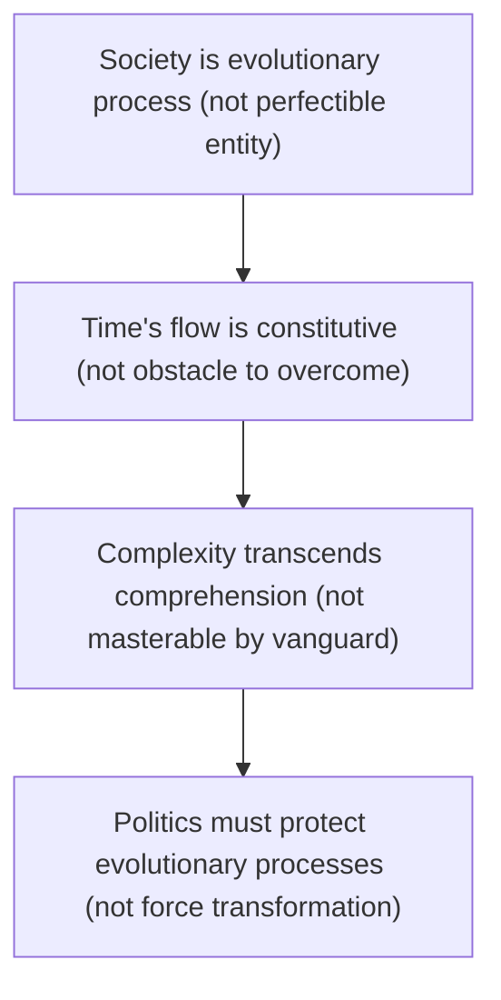

# The Principle Worldview

Blueprint's logic is complete. Believing in endpoints generates centralization, planning, teleology---systematically, when unconstrained by robust structures.

Now for the opposite stance: denying that endpoints exist. Not a different endpoint, but rejecting the endpoint concept itself.

This chapter develops the full Principle logic---**for the first time**. From ontology to epistemology to ethics to politics. The complete alternative worldview.

**Important**: Like Blueprint Type, Principle Type is an **ideal type**---pure logical form. Most reality mixes elements. This chapter presents pure Principle logic to reveal its structure.

**No pure empirical examples exist.** Real political movements---including those called "conservative"---always involve some concrete policy commitments. Once applied to reality, pure Principle logic necessarily "collapses" into specific positions on actual issues. Chapter 5 will examine how real conservatism relates to this ideal type through the meta-conservative framework.

Note: Anarcho-capitalism and libertarian utopianism are **not** Principle Type---they hold endpoints (perfect stateless society, pure liberty) and thus belong to Blueprint logic despite advocating distributed power. Principle Type denies **all** endpoints, including libertarian ones.

The exposition proceeds through logical levels, showing systematic derivation.

## 4.1 Core Definition

Principle Type is political logic derived from single metaphysical commitment: history has no endpoint; society evolves perpetually without terminus; the concept of "perfect state" is ontologically mistaken.

This commitment generates complete political worldview---systematically, coherently, opposite to Blueprint Type.

The rejection is categorical. Not "We haven't found the endpoint yet" (postponement). Not "Current endpoints are wrong but correct one exists" (different content). But "The endpoint concept itself is incoherent" (categorical rejection).

This featured rejecting libertarian or anarcho-capitalist "perfect stateless society" as endpoint. If you believe "zero state" is knowable, achievable perfection, you hold endpoint-belief---even if your endpoint is "pure freedom." Principle Type denies all perfect states, including libertarian ones.

Society isn't entity approaching ideal form. It's evolutionary process without completion. No final state exists where essential change should cease. Attempting temporal arrest violates reality's nature.

No-endpoint commitment generates opposite politics systematically. If no endpoint exists, current reality isn't "deviation from ideal"---it's adaptive process responding to conditions. Politics can't "close gap" between reality and perfection because no gap exists to close. Comprehensive transformation isn't necessary because there's no destination to reach. Knowledge of perfection is impossible because perfection doesn't exist to know. Means can't be justified by perfect ends because no perfect ends exist. From this metaphysical denial flows systematic political structure opposing Blueprint at every level.

Structural implications derive logically. If society is evolutionary process without endpoint, politics must protect evolution, not force transformation. This means distributing power because knowledge is dispersed---no authority can comprehend what emerged spontaneously, and centralized direction disrupts evolutionary adaptation. It means enabling markets because prices signal relative scarcity and spontaneous coordination aggregates dispersed knowledge, while planning cannot replicate evolutionary efficiency. It means protecting intermediaries because family, community, and voluntary associations are evolutionary infrastructure---sites of experimentation, preservation of local knowledge, and mediation between individual and state. It means protecting asynchronous evolution because different communities adapt at different paces, and forcing synchronized transformation prevents learning from variation. It means maintaining principles because no endpoint justifies unlimited means---deontological constraints hold regardless of goals, and process matters independent of outcomes.

These implications derive systematically from rejecting endpoints, just as opposite implications derived from affirming them.

This chapter develops ideal-typical Principle logic. Reality is always mixed. But understanding pure logic reveals what Principle tendencies look like when applied consistently.

Once Principle Type is applied to actual politics, it must make concrete commitments---on tax rates, regulation levels, welfare policies, and so on. This "collapse" from pure logic to specific positions is inevitable and necessary. Chapter 5's meta-conservative framework will examine how this collapse occurs and what different conservatives share despite their varying concrete commitments.

The derivation proceeds through five logical levels. Section 4.2 examines ontology: What kind of entity is society if it cannot reach perfection? What is time's nature if history has no terminus? Section 4.3 examines epistemology: If no endpoint exists, what can we know? Why is comprehensive planning epistemically impossible? Section 4.4 examines ethics: If no perfect ends exist, how are means constrained? Why do principles limit goals? Section 4.5 examines politics: How do ontological, epistemological, and ethical premises translate into distributed power, markets, and evolutionary processes? Section 4.6 examines organic evolution: What are evolution's necessary features when politics protects rather than forces?

**Section 4.7** examines historical patterns and scope conditions: When does Principle logic manifest? What are its boundaries?

The logic unfolds systematically. Each level follows from previous. By the end, a complete worldview emerges---coherent, comprehensive, fundamentally opposed to Blueprint Type.

## 4.2 Ontology: Perpetual Evolution

Principle Type begins with ontological commitment about society's fundamental nature: **society is evolutionary process without terminus**.

Not merely "we don't know the endpoint" (epistemic humility) but "no endpoint exists" (ontological claim). This is metaphysical commitment about what kind of thing society is.

Three interconnected ontological commitments structure Principle logic:

### 4.2.1 Society as Evolutionary Process

Society is not entity capable of completion but process of perpetual adaptation. This treats society as complex adaptive system---not "something that evolves" (entity that changes) but "evolution itself" (process as fundamental reality).

Evolutionary process means several things. Continuous adaptation occurs because problems solved create new problems. Technology shifts scarcity to new domains. Cultural changes generate new tensions. Political solutions create unintended consequences requiring further adjustment. The process never completes because completion is ontologically impossible. Distributed experimentation happens because no central authority designs solutions. Individuals, families, communities, firms, and associations all experiment with different approaches. Successes propagate; failures die out. Selection mechanisms operate continuously. Emergent order arises as patterns nobody planned emerge from millions of decentralized decisions. Markets coordinate production without central direction. Languages evolve without language academies. Norms develop without legislation. Common law emerges from accumulated precedents. These orders are too complex for any mind to design---they emerge from evolutionary process. Path dependence shapes development because current arrangements reflect historical development, not optimal design. Institutional forms that worked in past contexts persist, adapt, or dissolve based on changing conditions. No "reset" creates perfect institutions from blank slate.

Blueprint and Principle approaches contrast fundamentally. Blueprint holds that society approaches knowable ideal, current state is temporary imperfection, and transformation closes gap. Principle maintains that society adapts perpetually, current state is historical product, and adaptation continues without terminus.

If society is evolutionary process, several implications follow. "Perfect state" is category error---like asking "what is perfect evolution?" Politics cannot "achieve" perfection---only enable or obstruct adaptation. Current institutions aren't "deviations from ideal" but evolved responses to historical conditions. Change isn't progress toward destination but adaptation to shifting circumstances. Stability isn't achieved perfection but temporary equilibrium requiring continuous adjustment. The endpoint concept doesn't merely fail empirically---it misunderstands ontologically what kind of thing society is.

### 4.2.2 Time's Flow Is Constitutive of Existence

Time's flow isn't obstacle to overcome but condition of existence itself. Not "time prevents reaching perfection" (time as problem) but "time's perpetual flow is how reality exists" (time as fundamental). This is deep ontological commitment about temporality.

Heraclitus, not Parmenides, captures reality's nature. Reality is flux, not being. "You cannot step into the same river twice." Change isn't deviation from stability---change is fundamental, stability is temporary pattern within flux. Process philosophy in the Whitehead and Bergson tradition holds that reality is becoming, not being. Entities are events, not substances. Existence is temporal through and through. Conservative temporality appears in Burke's partnership between past, present, and future, where society is living organism developing over time. Oakeshott's sea without harbor or destination expresses this---time cannot be arrested without destroying what makes society living.

Attempting temporal arrest violates reality's nature. Blueprint seeks to freeze society at endpoint. But if time's flow is constitutive, freezing is impossible. Reality continues changing. Attempting to prevent change requires ever-increasing force, generating the escalating terror Blueprint regimes exhibit. Jacobins declared Year Zero, yet history continued. Soviets attempted to perfect communist society, yet contradictions persisted. Nazis dreamed thousand-year Reich, yet change was inescapable. Khmer Rouge evacuated cities to create timeless agrarian commune, yet time flowed regardless. Time cannot be arrested because time isn't external container for events---it's how events exist. Stopping time would require stopping existence itself.

If time's flow is constitutive, systematic implications follow. Politics must work with temporal flow, not against it. Institutions must adapt continuously, not achieve fixed perfection. Attempting to preserve "ideal state" forever generates violence as reality resists. Evolution is normal; stasis is impossible. The question isn't "how do we reach perfection?" but "how do we enable adaptive evolution?" This ontological commitment generates systematic political implications opposing Blueprint at every level.

### 4.2.3 Complexity Transcends Comprehension

Social complexity exceeds any individual's or group's comprehension capacity. Not "society is difficult to understand" (epistemic challenge) but "society's complexity transcends comprehensive understanding" (impossibility).

Complexity is irreducible for several reasons. Dispersed knowledge means millions of individuals possess local, contextual, tacit knowledge---knowledge of particular circumstances of time and place. No central authority can aggregate this knowledge. The farmer knows local soil; the entrepreneur knows local market; the worker knows specific techniques. This knowledge is distributed, not concentratable. The tacit dimension matters because much knowledge cannot be articulated. Polanyi observed: "We know more than we can tell." Skilled craftsmanship, cultural understanding, practical wisdom---these forms of knowledge resist codification. You can't write comprehensive planning manuals for what people know but cannot express. Emergent properties appear because society exhibits emergent patterns unpredictable from individual components. Market prices emerge from decentralized exchanges. Cultural norms emerge from countless interactions. Legal precedents emerge from accumulated decisions. Nobody designed these patterns---they emerged from complex interactions. Dynamic change ensures that even if we could comprehend current state, conditions change. Technology develops, preferences evolve, resources shift, contexts transform. Any comprehensive understanding becomes obsolete as reality changes. Feedback loops add complexity because social systems exhibit complex feedback---changing one variable affects others, which affect the first, creating non-linear dynamics. Central planning cannot model these interactions without generating prediction errors that compound catastrophically.

Blueprint and Principle epistemologies contrast fundamentally. Blueprint holds that vanguard can know enough to design perfection, comprehensive planning is possible, and society can be transformed according to plan. Principle maintains that complexity transcends comprehension, comprehensive planning is impossible, and spontaneous coordination through distributed decision-making must be enabled.

If complexity transcends comprehension, several implications follow. No person or organization can design society rationally. Attempting comprehensive transformation disrupts evolved orders. Spontaneous orders---markets, cultures, norms---coordinate better than designed plans. Humility about human capacity to engineer society is ontological necessity, not mere prudence. Politics must enable evolution, not force design. This ontological commitment grounds Principle epistemology examined next.

### 4.2.4 The Ontological Package

These three commitments form coherent package:

Each reinforces others. If society is evolutionary process, time's perpetual flow is how evolution occurs. If complexity transcends comprehension, forcing transformation based on claimed knowledge disrupts what cannot be comprehended. If time cannot be arrested, attempting to preserve perfection violates ontological reality.

Blueprint and Principle ontologies oppose fundamentally. Blueprint ontology: Entity → Destination → Arrest → Perfection. Principle ontology: Process → Evolution → Flow → Adaptation. These aren't different opinions about same reality. They're different understandings of what kind of thing reality is. From these ontological differences flow systematic epistemological, ethical, and political differences.

## 4.3 Epistemology: Rational Humility

If society is evolutionary process too complex to comprehend, what can we know? Principle epistemology combines strong claims about human limits with confidence in dispersed knowledge coordinated through evolved mechanisms.

### 4.3.1 The Knowledge Problem (Hayek)

Friedrich Hayek's central insight: The knowledge required for central planning doesn't exist in aggregable form.

This is not merely incomplete knowledge but impossible knowledge. Central planning requires knowing all resources available, all technologies possible, all preferences of all individuals, all local conditions, how all variables interact, and how conditions will change. This knowledge doesn't exist aggregated anywhere. It's distributed across millions of minds, much of it tacit, much local to specific contexts, all changing continuously.

The calculation debate of the 1920s-1930s between Mises, Hayek and socialist economists clarified this issue. Socialists claimed central planning could rationally allocate resources using mathematical optimization. Mises and Hayek responded that without market prices, no rational calculation is possible---prices aggregate dispersed information about relative scarcity while central planners lack this information mechanism. The debate wasn't merely "is planning difficult?" but "is planning possible in principle?" Hayek's answer was no: the knowledge exists only dispersed, emerges only through market process, and cannot be centralized without losing its informational content.

Several implications follow. Comprehensive social engineering is epistemically impossible---not "we don't know enough yet" but "the knowledge cannot exist in comprehensive form." Market prices are discovery mechanism, not merely allocation tool. Spontaneous order coordinates dispersed knowledge better than designed plans. Humility about planning capacity is rational necessity, not conservative temperament. This epistemic impossibility generates political necessity: distribute decision-making to use dispersed knowledge.

### 4.3.2 Evolved vs. Designed Knowledge

Principle epistemology distinguishes two knowledge types:

Designed knowledge is explicit, articulable, and transferable. Scientific theories, mathematical proofs, written instructions. This knowledge can be centralized, taught, applied consciously.

Evolved knowledge is implicit, embodied, and contextual. Traditional practices, cultural norms, institutional forms, tacit skills. This knowledge develops through trial and error over generations, preserves what worked, discards what failed---without anyone explicitly understanding why.

#### 4.3.2.1 Why Evolved Knowledge Matters

Many institutional forms work without anyone comprehending why. Common law developed through precedent, not rational design, yet coordinates expectations effectively. Market mechanisms coordinate production, though Adam Smith's "invisible hand" was discovery, not design. Cultural norms regulate behavior more effectively than comprehensive legal codes.

Destroying evolved knowledge to implement rational designs loses wisdom accumulated through experience. Soviet collectivization destroyed peasant farming practices evolved over centuries---practices preserving local knowledge about cultivation, irrigation, seasonal patterns. Central planners couldn't replicate this tacit wisdom. Result: agricultural collapse.

#### 4.3.2.2 Chesterton's Fence

G.K. Chesterton's principle: Don't remove a fence until you understand why it was built.

If you encounter fence in field, impulse might be: "This fence serves no purpose; remove it." But fence might prevent cattle wandering, mark property boundary, or block dangerous path. If you don't understand function, removing fence creates problems you didn't anticipate.

Traditional institutions are Chesterton's fences. They might seem irrational, inefficient, or obsolete. But they might preserve evolved solutions to problems we no longer recognize. Removing them based on rationalist confidence destroys knowledge we didn't know we had.

The conservative epistemic stance follows from this:

Presumption favors evolved forms over designed alternatives. Not because evolution is perfect but because it's tested. Evolved institutions survived precisely because they solved problems---problems we might not comprehend explicitly.

This doesn't mean "never change." It means: reforms should be incremental, empirical, reversible. Test changes against reality. Preserve institutional ecology enabling learning from failure.

Blueprint and Principle approaches contrast sharply. Blueprint holds that reason or science can design perfect society, traditional forms should be destroyed, and rational plans implemented. Principle maintains that evolved forms preserve dispersed wisdom, reforms should proceed gradually, and we must learn from results.

### 4.3.3 The Limits of Reason

Principle Type doesn't reject reason. It delimits reason's proper domain.

Reason can solve bounded problems with clear parameters, develop abstract theories about general patterns, criticize existing arrangements, propose experimental reforms, analyze unintended consequences, and coordinate explicit knowledge.

But reason cannot comprehend all relevant variables in complex systems, aggregate tacit knowledge distributed across millions, predict emergent properties of social interactions, design institutions superior to evolved alternatives in all dimensions, overcome knowledge problem through better modeling, or replace evolutionary selection with rational planning.

Hayek identified the rationalist hubris as "fatal conceit"---believing reason can design society comprehensively. This isn't mere error but category mistake. Reason is powerful tool for specific purposes. But comprehensive social design requires knowledge reason cannot possess.

Oakeshott distinguished technical knowledge---explicit, teachable, articulable like cooking recipes---from practical knowledge---implicit, learned through practice, contextual like actually cooking well. Politics requires practical knowledge: judgment developed through experience, sensitivity to context, understanding of tradition. Rationalist politics tries reducing practical knowledge to technical knowledge, attempting comprehensive rules replacing contextual judgment. This necessarily fails because practical knowledge cannot be fully articulated.

Burke's epistemic conservatism holds that individual reason is weak while accumulated wisdom of tradition is strong. Not because individuals are stupid but because individual lifespan is short while tradition spans generations, individual experience is narrow while tradition aggregates countless experiences, and individual perspective is partial while tradition represents collective learning. The "species is wise" not because any member is wise but because evolutionary selection preserves what works across time. Therefore: presume tradition contains wisdom even when we don't understand it, reform carefully, respect evolved forms, and trust process over individual reason.

If reason has limits, several implications for politics follow. Politics cannot be purely rational reconstruction. Traditions deserve respect as repositories of evolved knowledge. Comprehensive transformation based on theoretical designs will fail. Incremental reform enabling learning is epistemically superior. Distributed decision-making uses more knowledge than central direction. Humility is rational stance, not mere temperament. This epistemic humility generates ethical constraints examined next.

## 4.4 Ethics: Principles Constrain Means

If no perfect endpoint exists, ethics cannot be purely consequentialist. Principle Type maintains deontological constraints: some means are wrong regardless of outcomes.

### 4.4.1 Why Deontology Is Necessary

The fundamental ethical difference from Blueprint is:

Blueprint ethics: Perfect endpoint exists → infinite good → finite costs justified → ends justify means (when necessary)

Principle ethics: No endpoint exists → no infinite good → means must be independently justified → principles constrain outcomes

If no endpoint exists to justify means, several constraints follow.

What makes actions right or wrong? Not consequences measured against perfect state (no such state exists). But adherence to principles constraining what may be done to pursue any goal.

Three grounds support deontological constraints.

**First: Dignity constraint**

Persons aren't mere means to ends---they possess inherent dignity requiring respect. Kant: "Act so that you treat humanity, whether in your own person or in that of another, always as an end and never as a means only." This isn't contingent on consequences. Even if treating persons as mere means would produce better aggregate outcomes, it violates dignity. Why this matters without endpoints: If no perfect society justifies any means, then respect for persons provides independent ethical ground. Can't sacrifice individuals for collective perfection that doesn't exist.

Process constraint matters because how we act shapes who we become. Means and ends aren't separable---means determine actual ends achieved. Using violence to achieve peace creates violent society, not peaceful one. Aristotle held that virtues develop through practice and vicious means corrupt practitioners. Therefore means must conform to principles independent of goals. Why this matters without endpoints: If we cannot know final consequences (future is uncertain, complexity transcends prediction), process ethics is more reliable than consequentialism. Act according to principles rather than uncertain outcome predictions.

Plural values constraint recognizes that multiple goods exist---freedom, justice, compassion, beauty, knowledge, community. These goods are incommensurable. No single value trumps all others. No calculation determines optimal trade-offs. Isaiah Berlin's value pluralism holds that goods conflict irreducibly. Liberty and equality sometimes conflict; justice and mercy sometimes conflict. No perfect harmony resolves all tensions. Why this matters without endpoints: If no endpoint synthesizes all values, we navigate perpetual tensions. Principles prevent sacrificing everything for single value. Constraints preserve value pluralism.

### 4.4.2 What Principles Constrain

Individual rights function as constraints. Rights aren't merely useful (utilitarian view) or tools toward perfection (Blueprint view). Rights are side-constraints (Nozick): boundaries on what may be done to persons regardless of outcomes. Freedom of speech is protected not because it always produces best outcomes---it doesn't, as lies spread and demagoguery wins---but because respecting persons requires respecting their voice. Property rights are protected not because markets are perfectly efficient---they aren't---but because forcibly taking what someone produced violates their agency. Due process is required not because it's efficient---it's not, as trials take time---but because punishing without hearing violates dignity. These rights constrain what may be done even to achieve better outcomes.

Procedural justice matters because how decisions are made matters independent of what is decided. Democratic procedures, fair trials, transparent processes---these aren't merely instrumental to good outcomes. They're independently valuable. A policy might be substantively good but procedurally illegitimate if imposed without consent. Principle Type insists: process matters. Illegitimate means corrupt even good outcomes.

Moral rules function as constraints. Don't murder innocents, even to prevent greater harm. Don't torture, even to extract information saving lives. Don't lie systematically, even if truth causes suffering. These aren't absolute---Principle Type isn't absolutist. They're strong presumptions requiring extraordinary justification to override. And importantly: The justification cannot be "this advances the endpoint" because no endpoint exists.

### 4.4.3 The Practical Moderation

Deontological constraints moderate politics practically in several ways.

They prevent escalation. Blueprint teleology tends toward escalation: if some coercion is necessary to reach endpoint, why not more? Each stage justifies next. Deontological constraints break this cycle: some means are prohibited regardless of goals. The constraints don't change based on circumstances. Therefore, no automatic escalation from moderate means to extreme terror.

They preserve pluralism. If multiple values matter and conflict irreducibly, politics must navigate trade-offs rather than optimize single value. This generates pragmatic incrementalism rather than revolutionary transformation. Can't sacrifice all freedom for equality---both matter. Can't sacrifice all justice for order---both matter. Must balance competing goods.

They require consent. If persons have rights, imposing comprehensive transformation without consent violates those rights. Therefore politics proceeds through persuasion, negotiation, gradual reform---not revolutionary force. Blueprint holds that masses will understand after transformation succeeds, justifying force now for vindication later. Principle holds that transformation cannot be forced, requiring persuasion first and consent for changes.

They encourage accepting imperfection. If no perfect state exists and means are constrained, politics accepts permanent imperfection. Best isn't achievable; good enough is goal. This modesty prevents the perfectionist fanaticism generating Blueprint terror. If perfection is impossible, we muddle through rather than destroying everything pursuing unachievable ideals.

### 4.4.4 Contrast with Teleological Ethics

Blueprint teleology holds that the endpoint is infinite good, means are finite costs, therefore costs are justified when necessary, historical necessity adds urgency, revolutionary morality supersedes bourgeois constraints, and the result is escalating terror as purity spirals.

Principle deontology maintains that no endpoint exists to provide infinite justification, means must be independently justified, therefore strong constraints exist regardless of goals, process matters as much as outcomes, traditional morality provides stable constraints, and the result is moderation through principled limits.

The ethical difference generates systematic political differences examined next.

## 4.5 From Philosophy to Politics

Ontology, epistemology, and ethics generate political structures. This section traces how Principle philosophy translates into Principle politics.

### 4.5.1 Distribution of Power

The logical derivation proceeds straightforwardly. If society is evolutionary process (ontology), knowledge is dispersed and incomplete (epistemology), and no endpoint justifies unlimited means (ethics), then concentrating power in central authority is epistemically impossible and ethically illegitimate. Distributed power enables use of dispersed knowledge. Multiple power centers check each other. Therefore: distribute power across institutions, levels, and actors.

Centralization fails for systematic reasons. Central authority cannot aggregate knowledge required for comprehensive direction. Attempting comprehensive control disrupts spontaneous coordination. Centralized power invites abuse---concentrating power invites its misuse regardless of intentions. Therefore, distribute power structurally so no authority monopolizes decision-making.

Distribution works through several mechanisms. Federalism divides power between national and local governments, where local authorities handle local matters using local knowledge and national government handles coordination problems, with neither monopolizing authority. Separation of powers creates executive, legislative, and judicial branches that check each other---Madison observed that "Ambition must be made to counteract ambition," ensuring no single branch dominates. Bicameralism establishes two legislative chambers with different constituencies that slow hasty decisions, require broader consensus, and prevent majority tyranny. Independent intermediaries---civil society organizations, churches, universities, media, businesses---operate independently, checking government power and providing alternative sources of authority and meaning. Constitutional limits impose written constraints on what government may do, where rights protect individuals, procedural requirements slow radical change, and amendment processes require supermajorities.

Principle Type societies distribute power systematically across vertical dimension (federal versus state versus local), horizontal dimension (executive versus legislative versus judicial), social dimension (government versus civil society), and temporal dimension (constitutional constraints versus current majorities). This distribution prevents power concentration enabling totalitarianism.

Historical examples illustrate this pattern. American Constitution explicitly designed power distribution through federalism, separation of powers, Bill of Rights, and judicial review. Madison's Federalist #51 explained: "If men were angels, no government would be necessary. If angels were to govern men, neither external nor internal controls on government would be necessary." British evolution gradually distributed power as monarchy was checked by Parliament, Parliament divided into Commons and Lords, and common law protected rights, leaving no single authority absolute. Swiss confederation exemplifies extreme federalism, where cantons retain extensive autonomy, national government remains minimal, direct democracy operates at local level, and power is maximally distributed.

### 4.5.2 Market Coordination

The logic follows necessarily. If comprehensive planning is epistemically impossible (knowledge problem), central direction disrupts evolved coordination (ontology), and forcing economic outcomes violates rights (ethics),

then markets should coordinate most economic activity. Prices signal relative scarcity. Profit and loss provide feedback for adaptation. Spontaneous order emerges without central direction. Therefore, rely on market mechanisms, not comprehensive planning.

Markets perform several essential functions. They aggregate dispersed knowledge so no central planner needs to know all local conditions---prices emerge from millions of exchanges, incorporating all relevant information participants possess. They coordinate production and consumption without anyone directing, as entrepreneurs respond to price signals, consumers signal preferences through purchasing, and workers signal labor through wages, allowing the system to coordinate spontaneously. They enable experimentation as firms try different products, technologies, and organizational forms, where successes profit and expand while failures lose and contract, and selection operates continuously without requiring central approval. They adapt to change automatically---when conditions change through new technology, shifting preferences, or resource discoveries, prices adjust without any central committee needing to redesign the economy. They generate innovation because profit incentives reward finding better ways to satisfy wants, competition drives improvement, and creative destruction replaces obsolete forms with superior alternatives.

Soviet experience vindicated Hayek's knowledge problem critique. Gosplan couldn't calculate optimal allocations. Chronic shortages of some goods emerged alongside surpluses of others. Technological stagnation occurred. A growing gap with market economies developed. The knowledge problem manifested catastrophically---not because Soviet planners were incompetent or corrupt (though some were), but because the task was impossible. The knowledge required doesn't exist in form central planners can use.

Principle Type doesn't claim markets solve everything. Markets fail when property rights are unclear or unenforceable, externalities are significant (pollution, public goods), information asymmetries are severe, natural monopolies exist, or coordination problems require collective action. But the default should be market coordination. Government intervention requires specific justification. Burden of proof is on those claiming planning is superior to spontaneous order in particular domain.

Comprehensive economic planning requires comprehensive political power, as Blueprint logic demonstrated. Therefore, limiting economic planning helps limit political power. Market economies and political freedom correlate because distributed economic power prevents total political power. Hayek's "Road to Serfdom" showed that economic planning leads to political tyranny---can't plan economy comprehensively without controlling all other aspects of life. Economic freedom is necessary (not sufficient) for political freedom.

### 4.5.3 Protection of Intermediaries

The logical derivation follows. If knowledge is distributed across communities (epistemology), evolution requires variation and experimentation (ontology), and individuals have rights to association (ethics), then intermediary institutions between individual and state must be protected. Family, church, community, and voluntary associations preserve pluralism. These institutions enable distributed learning. Therefore, protect intermediaries rather than destroying them.

Intermediaries perform vital functions. They serve as sites of experimentation where different communities try different approaches to education, welfare, and cultural practice---successful innovations spread while failures are localized, enabling evolutionary learning through distributed experimentation. They function as repositories of local knowledge, where communities preserve practical wisdom about local conditions, urban versus rural communities know different things, and regional cultures adapt to different contexts---knowledge that would be lost under centralized uniformity.

**Mediators of power**: Intermediaries stand between individual and state, preventing both atomization (individuals defenseless against state) and total control (state penetrating all life). They provide alternative sources of authority, meaning, and belonging.

**Schools of virtue**: Tocqueville emphasized associations as "schools" teaching civic participation, mutual trust, cooperative norms. Bowling leagues, churches, volunteer fire departments---these associations cultivate social capital that markets and states cannot provide.

**Checks on state power**: When intermediaries are strong, state cannot easily dominate. Churches maintain moral authority. Universities preserve intellectual independence. Media provides critical scrutiny. Business associations resist overregulation. Strong civil society constrains state power.

Why Blueprint destroys intermediaries

Chapter 3 showed: Blueprint logic systematically generates intermediary destruction. Divided loyalties obstruct transformation. Alternative authorities compete with state. Intermediaries preserve traditional patterns resisting synchronized change.

Principle logic requires opposite: Intermediaries must be protected precisely because they distribute power, preserve knowledge, enable experimentation, and constrain state authority.

Historical examples illustrate this requirement. Tocqueville's America featured dense associational life through townships, churches, voluntary associations, and local governments---these intermediaries made American democracy work by distributing power and cultivating civic virtue. British civil society maintained ancient corporations, guilds, churches, universities, and local governments that limited Crown and Parliament power, preserved pluralism, and enabled gradual reform. Swiss cantons demonstrate extreme preservation of local autonomy where each canton maintains distinct institutions, laws, and cultures while national government coordinates but doesn't homogenize.

Modern erosion concerns some observers who argue modern states erode intermediaries even without totalitarian intent. Welfare states replace family and community mutual aid, centralized education displaces local variation, national regulation displaces local experimentation, media centralization displaces local journalism, and economic centralization displaces local business. Principle Type resistance argues for protecting intermediaries even at cost of some efficiency or uniformity through federalism, subsidiarity, and local autonomy that preserve evolutionary infrastructure.

### 4.5.4 Protection of Asynchronous Evolution

The logic proceeds as follows. If different contexts require different adaptations (ontology), local knowledge requires local pacing (epistemology), and forcing uniformity violates rights (ethics), then different communities should adapt at different paces, synchronized transformation prevents learning from variation, local conditions require local timing, and therefore asynchronous evolution across time and space must be protected.

Synchronization fails for systematic reasons. Blueprint logic demands spatio-temporal synchronization with same policies everywhere simultaneously to ensure uniformity approaching endpoint. But uniformity ignores contextual variation. What works in urban context fails in rural. What's appropriate for industrial economy is wrong for agricultural. What suits one culture clashes with another. Moreover, synchronized transformation prevents learning. If all regions try same policy simultaneously, failures are catastrophic and universal. If regions experiment at different paces, failures are localized and successes can be identified.

Federalism enables asynchrony by allowing different states to try different policies. Some experiment with innovation while others preserve traditional approaches. Successes spread gradually while failures don't cascade nationally. Justice Brandeis called states "laboratories of democracy"---let Massachusetts try one approach, Texas another, where evidence accumulates about what works and successful experiments spread organically. This requires tolerance for variation. Principle Type accepts that different communities will organize differently, no single optimal solution exists, and variation enables evolutionary learning.

Principle Type contrasts gradualism with revolutionary rupture, favoring gradual reform over revolutionary transformation. Gradual reform involves changes that are incremental and reversible, where evidence accumulates about effects, adaptation occurs over time, failures are localized, and learning is possible. Revolutionary transformation involves changes that are comprehensive and irreversible, where no evidence exists before commitment, adaptation is prevented, failures are catastrophic, and no learning occurs before disaster. Burke observed: "A state without the means of some change is without the means of its conservation." But change should be gradual, empirical, and respectful of what evolved.

Some changes require time for adaptation. Cultural changes can't force consciousness transformation immediately---values evolve through generational replacement, dialogue, and example, while forcing rapid cultural change generates backlash. Institutional changes require new institutions to develop legitimacy, accumulate tacit knowledge, and adapt to local conditions---imposed institutions without time for evolution remain alien. Economic transitions demonstrate that rapid economic transformation (shock therapy) creates disruption, while gradual transition allows retraining, reallocation, and adjustment. Principle Type advocates giving reforms time to work, allowing reversibility, enabling learning, and accepting that different regions will move at different paces.

### 4.5.5 Incrementalism and Prudence

If future is uncertain (epistemology), complexity generates unintended consequences (ontology), and comprehensive change risks catastrophe (ethics), then changes should be incremental rather than revolutionary, prudence requires testing before full commitment, reversibility enables learning from mistakes, and therefore incremental reform, empirical evaluation, and pragmatic adjustment are required.

Incrementalism is rational for several reasons.

**Unintended consequences**: Social systems are complex. Changing one variable affects others in unpredictable ways. Small changes generate observable consequences; comprehensive changes generate cascading failures.

**Option value**: Incremental changes preserve option to reverse. Revolutionary changes destroy alternatives. Preserving options has value under uncertainty.

**Learning**: Incremental changes enable learning from results. Revolutionary changes commit before evidence exists. Rational policy learns from feedback.

**Legitimacy**: Gradual changes build consensus. Revolutionary changes impose without consent. Legitimate politics requires persuading before implementing.

**Oakeshott's sailing metaphor**:

Politics is like sailing a "boundless and bottomless sea." No harbor for shelter, no floor for anchorage. No starting place or appointed destination.

The conservative disposition: Attend to present arrangements. Make small adjustments as conditions change. Prefer familiar to unknown. Avoid risky ventures promising distant benefits.

This isn't cowardice or stupidity. It's rational response to radical uncertainty. When you don't know where you're going (no endpoint), when the sea is boundless (no perfection), prudence requires incremental navigation, not revolutionary leaps.

**Karl Popper's piecemeal engineering**:

Popper distinguished between utopian engineering (comprehensive transformation toward ideal blueprint that risks catastrophe and cannot learn from mistakes before disaster) and piecemeal engineering (incremental reforms addressing specific problems that enable learning, limit catastrophe, and remain reversible). Rational politics is piecemeal---not because ambitions should be modest but because comprehensive engineering is epistemically impossible and practically dangerous.

The political implication:

Principle Type politics is incremental (not revolutionary), empirical (not ideological), pragmatic (not utopian), prudent (not risk-seeking), and adaptive (not transformative). This generates stability, moderation, and evolutionary improvement---opposing Blueprint's revolutionary transformation.

## 4.6 Organic Evolution: Five Features

When politics protects evolutionary processes rather than forcing transformation, what features characterize healthy evolution? This section identifies five necessary features:

### 4.6.1 Variation

Evolutionary learning requires variation. Monolithic uniformity prevents discovering what works.

Variation matters because if all communities adopt identical policies, no comparative evidence exists. If one approach fails, all fail simultaneously. If all experiment identically, no alternatives exist when problems emerge. Variation enables comparison across different approaches, localized failures rather than universal catastrophe, identification of successful innovations, and adaptation to different contexts.

Sources of variation include federalism where different states, cantons, or provinces try different policies---immigration versus assimilation policies differ across countries, welfare approaches differ across Nordic versus Anglo-American systems, and education models differ across regions. Cultural diversity allows different communities to maintain different values, practices, and norms through urban versus rural cultures, regional identities, ethnic communities, and religious pluralism. Institutional pluralism permits different organizational forms to coexist---for-profit versus nonprofit, cooperatives versus corporations, and public versus private provision. Technological experimentation enables different firms to try different technologies where competition generates variety and selection winnows failures.

Principle Type protects variation through federalism enabling policy variation, pluralism enabling cultural variation, free association enabling organizational variation, and markets enabling technological variation. Blueprint Type suppresses variation through centralization enforcing uniformity, cultural transformation eliminating diversity, state monopoly preventing organizational variety, and planning suppressing innovation.

### 4.6.2 Selection

Variation alone is insufficient. Selection mechanisms must identify successes and propagate them.

Selection operates through multiple channels. Market selection allows firms producing what consumers want to profit and expand while inefficient firms lose and contract, with no central authority deciding as price signals and profit/loss provide feedback. Political selection ensures policies that work get governments reelected while failed policies lead to electoral defeat, with democratic feedback providing the selection mechanism. Cultural selection spreads practices that help communities thrive to others while dysfunctional practices diminish, with cultural evolution occurring through imitation and adaptation. Institutional selection maintains institutional forms that coordinate effectively, allowing them to persist and spread, while ineffective institutions reform or dissolve, as seen in common law evolving through accumulated precedents.

Selection requires failure because selection cannot operate if nothing fails. Preventing all failure prevents learning what works. Therefore markets require allowing business failures, democracy requires allowing policy failures, culture requires accepting norm failures, and institutions require reforming failed forms.

Protecting against selection represents Blueprint tendency. Bailouts prevent market selection, authoritarianism prevents political selection, propaganda prevents cultural selection, and centralization prevents institutional selection. Blueprint Type fears selection because it might select against the endpoint. Principle Type embraces selection because it reveals what works.

### 4.6.3 Time

Evolution requires time. Rapid forced change prevents adaptive learning.

Why time matters

**Knowledge accumulation**: Institutional forms accumulate tacit knowledge over generations. Rapid change destroys this accumulated wisdom before new forms develop their own.

Legitimacy development requires that new institutions need time to develop legitimacy, as imposed institutions remain alien without time for cultural adaptation.

Generational replacement reflects that cultural changes often occur through generational replacement rather than conversion---older generation holds traditional values while younger generation adopts new ones, and forcing rapid change creates backlash.

Unintended consequences emerge because time reveals unintended consequences---immediate effects might be positive while longer-term effects prove destructive, and only time provides evidence.

Principle Type gives reforms time through gradual implementation, long evaluation periods, generational patience, and acceptance that some changes take decades. Blueprint Type denies time's necessity through revolutionary urgency, immediate transformation, Year Zero mentality, and impatience with gradual reform. The temporal difference is fundamental: Principle accepts time's role while Blueprint attempts temporal arrest.

### 4.6.4 Feedback Mechanisms

Evolution requires information about what's working and what isn't.

Types of feedback include price signals where market prices provide continuous feedback about relative scarcity, enabling coordinated adjustment without central direction. Electoral feedback operates as democratic elections provide feedback about policy satisfaction, enabling peaceful leadership change and policy correction. Legal feedback functions through court decisions providing feedback about constitutional boundaries, enabling rights protection and power limitation. Social feedback evolves as cultural norms develop through social approval and disapproval, gossip, reputation, and example---informal mechanisms regulating behavior.

Feedback requires freedom because genuine feedback requires freedom to criticize (suppressed criticism eliminates feedback), freedom to exit (trapped populations can't signal dissatisfaction), freedom to experiment (prevented experimentation eliminates learning), and freedom to compare (enforced uniformity eliminates comparative evidence).

Blueprint suppresses feedback through propaganda replacing genuine information, prevented exit (Berlin Wall), prohibited experimentation (planning eliminates), and prevented comparison (synchronization enforces uniformity). Principle protects feedback through free speech enabling criticism, migration enabling exit, federalism enabling experimentation, and variation enabling comparison.

### 4.6.5 Distributed Authority

Evolution requires distributed decision-making using dispersed knowledge.

Centralization prevents evolution because central authority cannot access all local knowledge, adjust to all local conditions, experiment with all alternatives, or learn from distributed failures. Therefore evolutionary learning requires distributed authority.

Forms of distribution include economic distribution where markets distribute economic decision-making to millions of entrepreneurs, workers, and consumers with no central economic authority. Political distribution operates through federalism distributing political authority across levels and separation of powers distributing across branches, with no single authority monopolizing. Social distribution functions through civil society distributing social authority across families, churches, associations, and communities with no state monopoly. Epistemic distribution allows universities, media, and experts to distribute epistemic authority with no single truth authority.

The systematic pattern:

Principle Type distributes authority across: Economic domain → Markets, Political domain → Federalism, separation of powers, Social domain → Intermediaries, and Epistemic domain → Pluralism.

This distribution enables evolutionary learning Blueprint's centralization prevents.

## 4.7 Historical Patterns and Scope Conditions

Previous sections developed Principle logic theoretically. This section examines historical patterns and acknowledges scope conditions.

### 4.7.1 The Pattern: Great Britain

**British evolution exhibits Principle logic**:

Distributed power featured Monarchy checked by Parliament (Glorious Revolution 1688), Parliament divided: Commons and Lords, Common law limits arbitrary power, Local government maintains autonomy, and No single authority absolute Protected intermediaries featured Church of England maintains social role, Ancient corporations, guilds persist, Universities independent, Local communities robust, and Civil society dense Gradual reform featured Parliamentary sovereignty develops over centuries, Suffrage expands incrementally (1832, 1867, 1884, 1918, 1928), No revolutionary rupture, and Evolved constitution, not designed Market coordination featured Industrial Revolution emerges spontaneously, Minimal state intervention initially, Common law protects property and contract, and Free trade movement (Corn Laws repeal 1846) Asynchronous development featured Different regions develop differently, Scotland maintains distinct legal system, Local variation accepted, and No forced synchronization Historical outcome: Stable liberal democracy, avoided totalitarianism, gradual reform tradition, strong civil society, evolutionary development.

Pattern consistent with Principle logic: Distributed power, protected intermediaries, gradual change, market coordination, tolerated variation.

### 4.7.2 The Pattern: United States

**American founding exhibits Principle logic explicitly**:

**Designed distribution** (unique feature):

Founders consciously designed distributed power system: Federalism: States vs. federal government, Separation of powers: Executive, legislative, judicial, Bicameralism: Senate vs. House, Bill of Rights: Constitutional constraints, and Judicial review: Courts check legislation.

Madison's Federalist #51: "Ambition must be made to counteract ambition." Deliberate design distributing power.

Protected intermediaries featured Strong civil society (Tocqueville's observation), Churches independent, Townships robust, Voluntary associations dense, and Local government significant Market coordination featured Constitutional protection of property and contract, Interstate commerce clause prevents trade barriers, Limited federal economic role initially, and Entrepreneurial culture Asynchronous experimentation featured States as "laboratories of democracy", Different states different policies, Migration enables "voting with feet", and Local control valued Gradual expansion of rights featured Suffrage expanded over time (property → universal male → women → 18-year-olds), Not revolutionary imposition but incremental reform, and Civil rights movement gradual (though facing resistance) Historical outcome: Stable constitutional republic (despite Civil War), avoided totalitarianism, strong federalism, vibrant civil society, economic dynamism.

Pattern consistent with Principle logic: Explicitly designed power distribution, protected intermediaries, incremental reforms, market economy, federal variation.

### 4.7.3 The Pattern: Switzerland

**Swiss confederation exhibits extreme Principle logic**:

Maximal federalism featured 26 cantons with extensive autonomy, Each canton different government forms, laws, National government minimal, Direct democracy at cantonal level, and Subsidiarity principle strong Protected local diversity featured Four official languages (German, French, Italian, Romansh), Religious diversity (Catholic, Protestant cantons), Cultural variation protected, and Local traditions preserved Distributed power featured No executive dominance (rotating Federal Council), Direct democracy referendums, Cantonal veto on national policies, and Extremely decentralized Gradual development featured Confederation forms incrementally (1291-1848), No revolutionary founding, Evolved through treaties and accommodations, and Continuous adjustment Historical outcome: Stable democracy, avoided wars (neutrality), high prosperity, strong local government, extreme federalism, cultural diversity.

Pattern consistent with Principle logic: Maximal distribution, extreme federalism, protected variation, gradual evolution, local autonomy.

### 4.7.4 Intellectual Tradition: Classical Liberalism

**Hayek, Mises, Friedman exhibit Principle logic philosophically**:

Epistemological humility featured Knowledge problem (Hayek), Calculation debate (Mises), and Dispersed knowledge arguments Spontaneous order featured Markets as discovery processes, Evolution vs. design, and Emergent coordination Distributed decision-making featured Property rights, Free markets, Limited government, and Individual liberty Gradualism and prudence featured Piecemeal engineering (Popper), Constitutional constraints, Rule of law, and Stable expectations **Pattern**: Coherent philosophical tradition deriving politics from epistemic premises about dispersed knowledge and complexity.

### 4.7.5 The Systematic Pattern

Across cases---Britain, America, Switzerland, classical liberal thought---similar patterns emerge:

Political structure featured Distributed power (federalism, separation, checks), Protected intermediaries (civil society, churches, local government), Gradual reform (evolutionary, not revolutionary), and Constitutional constraints (limited government) Economic coordination featured Market mechanisms, Property rights, Free exchange, and Entrepreneurial freedom Temporal approach featured Incremental change, Empirical evaluation, Patience with evolution, and Respect for tradition Epistemic stance featured Humility about comprehensive knowledge, Respect for evolved forms, Preference for distributed experimentation, and Skepticism about rational design **These aren't coincidental associations. They derive systematically from Principle logic**: Denying endpoints generates distributed power, market coordination, gradual reform, epistemic humility.

### 4.7.6 Scope Condition: The Community Boundary Problem

The imperial paradox emerges when examining Principle Type societies' domestic versus foreign policies. These societies avoided domestic totalitarianism and terror, yet engaged in imperial domination.

Britain demonstrates this paradox. Domestically, Principle logic operated through distributed power, protected intermediaries, and gradual reform. Imperially, Britain engaged in domination, exploitation, and occasional atrocities---colonial rule and famines in India, coercion and suppression in Ireland, and forcing drug trade on China through the Opium Wars.

America exhibits the same pattern. Domestically, the constitutional republic featured distributed power, federalism, and Bill of Rights. Against outsiders, America pursued Native American displacement, slavery, and imperial adventures---systematic displacement and massacres of indigenous peoples, chattel slavery denying all rights to Africans, and imperial expansion in the Philippines and Latin America.

How does the framework account for this? Is this a refutation?

#### 4.7.6.1 Partial Answer: Bounded Application

Principle logic constrained domestic politics more effectively than foreign or imperial policy.

Within the political community, structural protections operated. In Britain, Parliament checked the Crown, common law protected rights, and gradual reform proceeded. In America, the Constitution limited federal power, states checked each other, and courts protected (some) rights. Outside the political community, no such protections existed. Imperial subjects had no representation and no voice. Slaves were excluded from "We the People" and had no legal personhood. Indigenous peoples were not considered part of the political community.

Structural constraints operate within defined political communities. Within Britain and America, intermediary structures existed through Parliament, states, courts, and press, citizens had voice in governance, power was distributed among stakeholders, and Principle logic could constrain because these structures existed. Outside Britain and America, imperial subjects had no intermediaries in the metropole, colonies had no representation in Parliament, slaves had no legal standing, indigenous peoples had no voice in American politics, and no structural constraints operated.

The mechanism explains this limitation. Principle logic doesn't prevent all atrocities. It prevents systematic domestic terror and totalitarianism by distributing power among community members, protecting intermediary structures within community, and requiring consent of stakeholders. But if some humans are excluded from the "community" definition, they have no intermediaries to protect them, they have no power to distribute, they have no voice requiring consent, and Principle logic doesn't protect them.

#### 4.7.6.2 The "Who Counts" Question

This reveals the framework's boundary: Principle logic's scope is bounded by community definition.

Before asking "How should we organize politically?" (this framework's question), one must answer "Who is included in 'we'?" (a prior question).

If "we" equals propertied white males (18th century America), then Principle logic constrained how they governed each other but didn't constrain how they treated slaves, women, or indigenous peoples.

If "we" equals all citizens (20th century democracies), then Principle logic constrains more broadly but still doesn't necessarily constrain foreign policy toward non-citizens.

If "we" equals all humans (cosmopolitan ideal), then Principle logic would constrain universally, but this definition rarely held historically.

The framework doesn't explain community boundaries. This would require theory of political community formation (why some are included while others are excluded), theory of in-group versus out-group ethics (different moral rules for members versus outsiders), theory of imperial psychology (why domination of outsiders was acceptable to liberal societies), and theory of slavery's compatibility with liberty ideology. These questions lie beyond this book's scope. The framework analyzes political logic given community boundaries, not how boundaries form.

#### 4.7.6.3 The Structural Difference: Terror vs. Empire

Both are morally wrong but structurally different.

Totalitarian Terror (Blueprint extreme) involves systematic violence against own political community. Party purges party members (Soviet Great Purge), state murders its own citizens (Nazi Germany's Jews were German citizens), intermediaries within the community are destroyed, and no one is safe, not even elites. Robespierre guillotined fellow Jacobins, Stalin purged Old Bolsheviks, Mao targeted party intellectuals---self-consuming violence.

Imperial Domination (Principle societies' external policy) involves violence against outsiders to the political community. Metropole citizens remain protected, intermediaries within the metropole remain intact, and elites are safe domestically. British lords were not threatened by empire, American founders kept their property rights and political power, and domestic stability was maintained while exploiting abroad.

This is not a moral defense---both are deeply wrong. But a structural distinction exists: terror consumes own society creating totalitarianism that affects everyone with no safety, while empire exploits others while maintaining domestic order and protecting members. Principle logic prevents the former but doesn't prevent the latter.

#### 4.7.6.4 Acknowledging the Limitation

Principle Type societies avoid systematic domestic terror, totalitarianism, destroying their own intermediary structures, purging their own elites, and synchronized transformation of own society. But Principle Type societies don't necessarily avoid imperial domination, slavery of excluded groups, genocide of non-members, or exploitation of outsiders.

This doesn't refute the framework because the framework explains domestic political structure, not all moral outcomes. Principle logic distributes power within community, protects intermediaries of members, and constrains internal governance. It doesn't claim moral perfection, universal application to all humans, constraint on all forms of violence, or prevention of all atrocities.

Specifying scope conditions makes theory more precise, not weaker. Over-claiming invites refutation. Honest scope acknowledgment clarifies what framework does and doesn't explain. American slavery doesn't refute Principle framework's claim that distributed power prevents domestic totalitarianism---it reveals that distribution was bounded by racial exclusion. British imperialism doesn't refute Principle framework's claim that intermediaries constrain domestic terror---it reveals that intermediary protection extended to subjects, not imperial outsiders.

The framework explains what it claims: political logic given community boundaries. The framework doesn't explain what it doesn't claim: how boundaries form, why exclusion occurs, imperial psychology, or all moral outcomes. This is theoretical honesty, not weakness.

## Conclusion

This chapter developed Principle Type as ideal-typical logic derived from single commitment: history has no endpoint, society evolves perpetually, and the perfect state concept is ontologically mistaken.

From ontology: society is evolutionary process, time's flow is constitutive of existence, complexity transcends comprehension, and no terminus exists toward which society moves. For epistemology, comprehensive knowledge for social engineering doesn't exist---knowledge is dispersed, tacit, and local, evolved forms preserve wisdom, reason has limits, and humility is rational necessity. For ethics, no perfect endpoint justifies unlimited means---deontological constraints hold regardless of outcomes, dignity, process, and plural values require respecting principles, and ends don't automatically justify means. For politics, distribute power (knowledge is dispersed), enable markets (planning is impossible), protect intermediaries (preserve evolutionary infrastructure), protect asynchronous evolution (contexts differ), and pursue incremental reform (complexity generates unintended consequences).

Organic evolution requires variation, selection, time, feedback, and distributed authority. Politics must enable these features, not suppress them.

Historical patterns show that Britain, America, Switzerland, and classical liberal thought exhibit Principle logic through distributed power, protected intermediaries, gradual reform, and market coordination. Pattern is consistent within scope.

Scope condition acknowledged: Principle logic constrained domestic politics within defined political communities but didn't prevent imperial domination or exploitation of excluded groups. Community boundaries matter. Framework explains political structure given boundaries, not how boundaries form.

Principle Type is complete logical system with coherent derivation from temporal commitment to political practice. Whether this logic is preferable to Blueprint remains open question.

Part II has now developed both ideal types: Blueprint Type (Chapter 3) derives from endpoint-belief leading to centralization, planning, and teleology; Principle Type (Chapter 4) derives from endpoint-denial leading to distribution, markets, and deontology. Both logics are internally coherent, both have historical manifestations, and both have scope conditions.

Chapter 5 addresses: What IS conservatism? How does Principle Type relate to various conservatives who differ on content? The meta-conservative framework reveals what all conservatives share despite surface differences.

The analytical framework continues.

